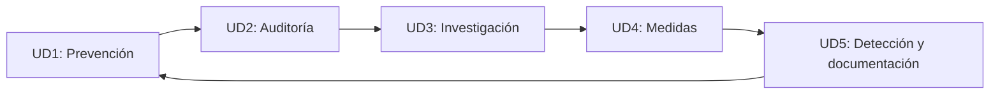

# Módulo profesional: Gestión de incidentes de ciberseguridad

  

> Bienvenido/a al módulo de gestión de incidentes de ciberseguridad. Este repositorio está pensado como una presentación inicial para el alumnado, con una organización por unidades didácticas, objetivos formativos, materiales, herramientas y cronograma del curso.

---

## 1. Presentación del módulo

La gestión de incidentes de ciberseguridad es una disciplina esencial dentro de la seguridad informática, ya que permite a la organización **detectar, analizar, contener, erradicar y recuperar** sistemas y servicios ante amenazas y eventos de seguridad.

El objetivo del módulo es proporcionar al alumnado una visión completa del ciclo de vida del incidente, desde la **prevención y la concienciación** hasta la **investigación, la implementación de medidas y la documentación final** del caso.

Este enfoque combina:

- la dimensión **técnica** (análisis, forense, herramientas, detección),
- la dimensión **organizativa** (roles, procedimientos, coordinación),
- la dimensión **formativa** (prevención, concienciación y mejora continua).

La finalidad es dotar al estudiante de una base sólida para actuar de forma ordenada y eficaz frente a incidentes reales, comprendiendo tanto la respuesta técnica como la responsabilidad institucional y operativa.

---

## 2. Objetivos generales

Al finalizar el módulo, el alumnado será capaz de:

- comprender qué es un **incidente de ciberseguridad** y cómo se diferencia de un simple evento;
- conocer los **fundamentos de la gestión de incidentes** y la **taxonomía** más habitual;
- aplicar el **ciclo de vida del incidente** en contextos reales;
- desarrollar actividades de **prevención y concienciación**;
- realizar **auditorías de incidentes** y valorar su alcance;
- investigar la causa raíz del problema;
- implementar medidas correctivas y preventivas;
- detectar, documentar y comunicar incidentes con rigor.

---

## 3. Unidades didácticas

### UD1: Planes de prevención y concienciación

**Objetivo:** preparar a la organización para reducir la probabilidad de que se produzcan incidentes y mejorar la resiliencia humana y procedimental.

**Contenidos principales:**

- conceptos básicos de seguridad y riesgo,
- políticas y normas de uso,
- concienciación del personal,
- seguridad operativa y buenas prácticas,
- formación en phishing, malware y comportamientos seguros,
- continuidad del negocio y preparación previa.

**Ejemplo de aplicación:**

Un usuario recibe un correo falso solicitando credenciales. La prevención consiste en formar al personal para detectar esta técnica, reforzar políticas de seguridad y activar mecanismos de validación, como MFA o revisión de enlaces sospechosos.

---

### UD2: Auditoría de incidentes

**Objetivo:** valorar y analizar la naturaleza, gravedad y alcance de un incidente antes de decidir la respuesta.

**Contenidos principales:**

- identificación de eventos y señales de alerta,
- análisis de impacto,
- priorización y clasificación del incidente,
- revisión de logs, eventos y evidencias,
- valoración del daño potencial,
- coordinación inicial del equipo de respuesta.

**Ejemplo de aplicación:**

Un SOC detecta un acceso extraño a un servidor. La auditoría inicial analiza si se trata de un acceso legítimo, si hubo movimiento lateral, qué cuentas se vieron afectadas y qué grado de impacto tiene sobre los servicios críticos.

---

### UD3: Investigación del incidente

**Objetivo:** determinar la causa raíz, el alcance y las técnicas empleadas por el atacante.

**Contenidos principales:**

- análisis forense de sistemas y red,
- extracción de indicadores de compromiso,
- revisión de procesos, conexiones y artefactos,
- evaluación de movimiento lateral,
- identificación de vulnerabilidades explotadas,
- reconstrucción de la cadena de eventos.

**Ejemplo de aplicación:**

Tras un ransomware, se analizan los logs del equipo infectado, los procesos ejecutados, los accesos registrados, los archivos cifrados y la actividad de red para establecer cómo se produjo la infección y qué alcance tuvo en la organización.

---

### UD4: Implementación de medidas

**Objetivo:** aplicar actuaciones de contención, corrección y reforzamiento para reducir el riesgo y restaurar la seguridad.

**Contenidos principales:**

- aislamiento de equipos y servicios,
- bloqueos de tráfico y direcciones,
- cambio de credenciales y revocación de accesos,
- restauración desde copias de seguridad limpias,
- aplicación de parches y medidas de hardening,
- mejora de controles de seguridad.

**Ejemplo de aplicación:**

Una cuenta administrativa ha sido comprometida. Se bloquea la cuenta, se revocan sesiones, se cambian contraseñas, se reinician sistemas afectados y se refuerzan políticas de acceso para evitar una nueva explotación.

---

### UD5: Detección y documentación

**Objetivo:** asegurar que la respuesta queda registrada, validada y preparada para la mejora continua.

**Contenidos principales:**

- monitorización y detección de eventos,
- registro de evidencias,
- cadena de custodia,
- documentación del incidente,
- análisis de lecciones aprendidas,
- presentación de resultados y cierre del caso.

**Ejemplo de aplicación:**

Tras la recuperación, se documentan las causas, los tiempos de respuesta, las medidas aplicadas, la evidencia recopilada y las acciones de mejora para prevenir que el incidente se repita.

---

## 4. Relación entre unidades y ciclo de vida del incidente

El módulo se articula sobre el ciclo de vida de la gestión de incidentes:

En términos operativos:

- **UD1** prepara la organización y reduce la probabilidad del incidente.
- **UD2** analiza y prioriza la situación cuando se produce una alerta.
- **UD3** investiga la causa raíz y el alcance real.
- **UD4** implementa las acciones técnicas y organizativas necesarias.
- **UD5** documenta el caso, valora la respuesta y consolida la mejora continua.

---

## 5. Herramientas software indispensables del curso

A lo largo del curso usaremos un conjunto de herramientas básicas para trabajar tanto en laboratorio como en análisis realista de incidentes.

### 5.1. Virtualización y entorno de laboratorio

- **VirtualBox**: entorno principal de máquinas virtuales para desplegar sistemas
- **Máquinas virtuales Windows**: para ejercicios de malware, ransomware y análisis de endpoints
- **Máquinas virtuales Linux**: para análisis de red, servidores y entornos de seguridad
- **Snapshots y clonación**: para conservar estados seguros y reproducibles del laboratorio

### 5.2. Herramientas de análisis y red

- **Wireshark**: captura y análisis de tráfico de red
- **Nmap**: escaneo de puertos, servicios y redes
- **tcpdump**: captura de paquetes desde terminal
- **PowerShell**: análisis de sistemas Windows y automatización de tareas
- **Bash / Linux shell**: administración y procesamiento de eventos en entornos Unix/Linux

### 5.3. Seguridad y detección

- **EDR / antivirus / antimalware**: detección de amenazas en endpoints
- **Firewall**: control de permisos y bloqueo de tráfico sospechoso
- **IDS/IPS**: detección de actividad mala o anómala en red
- **SIEM**: correlación de eventos y alertas
- **Herramientas de forense**: análisis de memoria, disco y artefactos digitales

### 5.4. Herramientas de apoyo al trabajo académico

- **Git y GitHub**: control de versiones y entrega de trabajos
- **Documentación de laboratorio**: cuaderno de apuntes, informes y trazas
- **Navegador web**: análisis de phishing, páginas maliciosas y recursos web

> El uso de máquinas virtuales es fundamental para poder practicar en un entorno controlado sin afectar a sistemas reales.

---

## 6. Software recomendado por tipo de práctica

| Tipo de actividad | Herramienta principal | Uso principal |
| --- | --- | --- |
| Virtualización | VirtualBox | respaldar el laboratorio con equipos virtualizados |
| Detección de tráfico | Wireshark | inspección de paquetes y comunicaciones |
| Reconocimiento de red | Nmap | escaneo y enumeración de servicios |
| Análisis de endpoints | Windows/Linux VM | reproducción de incidentes en sistemas reales |
| Malware / respuesta | antivirus + EDR | detección, aislamiento y análisis |
| Soporte documental | GitHub + Markdown | entrega de contenidos y seguimiento |

---

## 7. Metodología del curso

La metodología combina:

- **clase magistral**, para introducir los conceptos y el marco teórico,
- **demostración práctica**, con ejemplos de incidentes reales y simulados,
- **laboratorio**, basado en máquinas virtuales y entornos aislados,
- **análisis de casos**, para aplicar la teoría a situaciones concretas,
- **documentación**, para consolidar la respuesta a incidentes y la mejora continua.

La intención es que el alumnado no solo conozca la teoría, sino que también entienda cómo se articula la respuesta real en entornos organizativos.

---

## 8. Cronograma del curso

El módulo se desarrolla con una carga de **5 horas semanales**.

### Semana 1

| Día | Horario | Sesión | Tema |
| --- | --- | --- | --- |
| Martes 29 de septiembre | 2 horas | Sesión 1 | Presentación del módulo y UD1: planes de prevención y concienciación |
| Miércoles 30 de septiembre | 3 horas | Sesión 2 | UD1: continuidad, buenas prácticas y primeros casos prácticos |

### Distribución semanal recomendada

| Semana | Horas | Enfoque principal |
| --- | --- | --- |
| 1 | 5 h | Presentación + prevención + concienciación |
| 2 | 5 h | Auditoría de incidentes |
| 3 | 5 h | Investigación del incidente |
| 4 | 5 h | Implementación de medidas |
| 5 | 5 h | Detección, documentación y cierre |

> El calendario inicial se establece en la semana del 29 de septiembre: martes con 2 horas y miércoles con 3 horas.

---

## 9. Evidencias y evaluación

Durante el curso, el alumnado deberá demostrar la adquisición de competencias a través de:

- participación en actividades prácticas,
- análisis de casos de seguridad,
- documentación de incidentes,
- resolución de ejercicios de laboratorio,
- elaboración de informes sobre diagnóstico, análisis y respuesta.

La evaluación se orienta tanto a la **comprensión conceptual** como a la **capacidad de aplicar el ciclo de gestión de incidentes** en situaciones concretas.

---

## 10. Criterios de éxito del alumnado

Se considera que el estudiante ha adquirido la competencia del módulo cuando es capaz de:

- reconocer la diferencia entre evento e incidente,
- valorar la gravedad de un incidente,
- investigar y documentar el caso con rigor,
- aplicar medidas correctivas y preventivas,
- contribuir a la continuidad del negocio y a la mejora de la seguridad.

---

## 11. Resumen final

Este curso ofrece una visión práctica y formativa de la gestión de incidentes de ciberseguridad, organizada en cinco unidades didácticas que recorren el ciclo completo de la respuesta ante amenazas y eventos de seguridad.

La combinación entre **prevención**, **auditoría**, **investigación**, **implementación de medidas** y **documentación** permite al alumnado integrar los conocimientos teóricos con las habilidades técnicas y organizativas necesarias para responder con criterio en entornos reales.

---

## 12. Recursos del repositorio

- [README.md](README.md): presentación general del módulo
- [transversal/README.md](transversal/README.md): material base complementario
- [ud1](ud1): recursos y contenidos asociados a la unidad didáctica 1

> Este README funciona como landing page de presentación para el alumnado. Su propósito es orientar la estructura del módulo, mostrar el recorrido formativo y preparar el entorno de trabajo y el cronograma del curso.
