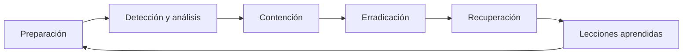

# Módulo profesional: Gestión de incidentes de ciberseguridad

  

> Bienvenido/a al módulo de gestión de incidentes de ciberseguridad. Este curso combina teoría, práctica, análisis forense y trabajo en laboratorio para formar al alumnado en la preparación, detección, respuesta y documentación de incidentes reales o simulados en entornos digitales.

---

## 1. Presentación del módulo

La gestión de incidentes de ciberseguridad es una disciplina esencial para cualquier organización, ya que permite detectar, analizar, contener, remediar y aprender de los eventos que pueden comprometer la confidencialidad, integridad y disponibilidad de los activos digitales.

Este módulo pone el foco en una perspectiva **técnica, operativa y estratégica**: no se trata solo de conocer herramientas, sino de comprender cómo se organiza la respuesta ante un incidente, cómo se analizan los indicadores de riesgo y cómo se documenta la actividad para mejorar la resiliencia del sistema.

### Objetivos formativos

- Comprender la diferencia entre **evento, incidente, amenaza, vulnerabilidad y riesgo**.
- Conocer el **ciclo de vida** de la gestión de incidentes.
- Aplicar una metodología de **auditoría, investigación, contención y recuperación**.
- Documentar y comunicar los hechos con rigor técnico y criterio organizativo.
- Trabajar con herramientas de análisis, virtualización y monitoreo en un entorno controlado.

### ¿Qué aprenderás?

- A identificar y priorizar incidentes de seguridad.
- A interpretar alertas, logs y evidencias digitales.
- A diferenciar entre respuesta técnica y respuesta institucional.
- A aplicar medidas de prevención, mitigación y mejora continua.
- A documentar casos y aportar lecciones aprendidas al sistema de seguridad.

---

## 2. Ruta formativa del curso

| UD | Denominación | Enfoque principal |
| --- | --- | --- |
| **UD1** | Planes de prevención y concienciación | Reducción del riesgo y cultura de seguridad. |
| **UD2** | Auditoría de incidentes | Identificación, valoración y clasificación del incidente. |
| **UD3** | Investigación del incidente | Análisis forense, causa raíz y reconstrucción de eventos. |
| **UD4** | Implementación de medidas | Contención, mitigación, recuperación y mejora. |
| **UD5** | Detección y documentación | Evidencias, informes, cierre y aprendizaje. |

### Recorrido formativo

- **UD1**: prevención, buenas prácticas, políticas y concienciación.
- **UD2**: detección, análisis, impacto y priorización de incidentes.
- **UD3**: diagnóstico técnico, reconstrucción del ataque y causa raíz.
- **UD4**: implementación de medidas de seguridad, contención y recuperación.
- **UD5**: documentación, notificación, cierre del caso y lecciones aprendidas.

---

## 3. Ciclo de vida de la gestión de incidentes

La respuesta a incidentes no es un proceso aislado, sino un ciclo continuo de mejora. La fase de **preparación** reduce el tiempo de reacción; la **detección y análisis** permiten confirmar si hay un problema real; la **contención** evita la propagación; la **erradicación** elimina la causa; la **recuperación** restaura capacidades; y las **lecciones aprendidas** fortalecen la organización.

---

## 4. Herramientas esenciales del curso

### Entorno de laboratorio

- **VirtualBox**: creación y gestión del entorno de pruebas.
- **Máquinas virtuales Windows y Linux**: simulación de escenarios reales.
- **Snapshots y clonación**: recuperación segura y reproducibilidad de pruebas.

### Herramientas de análisis y seguridad

- **Wireshark**: análisis del tráfico de red y detección de anomalías.
- **Nmap**: escaneo y descubrimiento de servicios y puertos.
- **PowerShell / Bash**: automatización y diagnóstico técnico.
- **Firewall / IDS / IPS**: control de tráfico y monitorización de eventos.
- **EDR / Antivirus / Antimalware**: detección y respuesta en endpoints.
- **SIEM**: correlación de eventos y alertas de seguridad.

### Trabajo académico e institucional

- **Git y GitHub**: control de versiones y distribución del material.
- **Markdown**: documentación técnica, informes y entregas.
- **Navegador web**: análisis de phishing y comportamiento sospechoso.

> El laboratorio virtual es un elemento clave del curso, ya que permite practicar sin poner en riesgo sistemas productivos reales.

---

## 5. Cronograma del curso

El módulo se desarrolla con **5 horas lectivas semanales** y se extiende a lo largo del curso escolar, finalizando aproximadamente en **mediados de junio**.

### Inicio del curso

| Día | Horario | Actividad |
| --- | --- | --- |
| **Martes 29 de septiembre** | 2 horas | Presentación general del módulo |
| **Miércoles 30 de septiembre** | 3 horas | UD1: prevención y concienciación |

### Calendario por unidades didácticas

| Unidad didáctica | Fechas estimadas | Duración |
| --- | --- | --- |
| **UD1: Planes de prevención y concienciación** | 29 sep - 16 oct | 3 semanas |
| **UD2: Auditoría de incidentes** | 19 oct - 30 oct | 2 semanas |
| **UD3: Investigación del incidente** | 2 nov - 20 nov | 3 semanas |
| **UD4: Implementación de medidas** | 23 nov - 18 dic | 4 semanas |
| **UD5: Detección y documentación** | 11 ene - 12 jun | 22 semanas |

### Secuencia general

| Periodo | Enfoque principal |
| --- | --- |
| **Septiembre - octubre** | Presentación, prevención y auditoría inicial |
| **Noviembre - diciembre** | Investigación del incidente y primeras medidas |
| **Enero - marzo** | Continuación de la respuesta y análisis práctico |
| **Abril - mayo** | Detención, documentación y fortalecimiento de la respuesta |
| **Junio** | Cierre, evaluación y presentación final |

> El calendario del módulo está diseñado para abarcar el curso completo y cerrar la programación en torno a **mediados de junio**, conforme a la secuencia de las cinco unidades didácticas.

---

## 6. Metodología de enseñanza

La metodología combina tres dimensiones clave:

- **Clase expositiva** para explicar conceptos y marcos de referencia.
- **Laboratorio práctico** para trabajar con herramientas y escenarios reales o simulados.
- **Documentación y análisis crítico** para consolidar el aprendizaje y la toma de decisiones.

El alumnado desarrollará competencias relacionadas con:

- análisis técnico,
- valoración de riesgo,
- respuesta operativa,
- elaboración de informes,
- mejora continua del sistema de seguridad.

---

## 7. Recursos del repositorio

- [README.md](README.md): presentación general del curso.
- [transversal/README.md](transversal/README.md): base teórica transversal del módulo.
- [ud1](ud1): materiales y recursos de la unidad didáctica 1.

---

## 8. Cierre

Este módulo tiene como objetivo formar a la persona estudiante en la gestión efectiva de incidentes de ciberseguridad, desde la prevención hasta la respuesta, pasando por la investigación, la mitigación y la documentación final. La combinación de teoría, práctica, análisis técnico y trabajo en laboratorio permite desarrollar competencias útiles para el entorno profesional y para la mejora continua de la seguridad digital.

---

  <strong>¡Bienvenidos/as al curso de gestión de incidentes de ciberseguridad!</strong>

