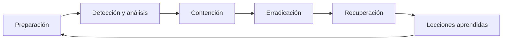

# Módulo profesional: Gestión de incidentes de ciberseguridad

  

> Bienvenido/a al módulo de gestión de incidentes de ciberseguridad. Este curso combina teoría, práctica, análisis forense y trabajo en laboratorio para formar al alumnado en la preparación, detección, respuesta y documentación de incidentes reales o simulados en entornos digitales.

## 1. Presentación del módulo

La gestión de incidentes de ciberseguridad es una disciplina esencial para cualquier organización, ya que permite detectar, analizar, contener, remediar y aprender de los eventos que pueden comprometer la confidencialidad, integridad y disponibilidad de los activos digitales.

Este módulo pone el foco en una perspectiva **técnica, operativa y estratégica**: no se trata solo de conocer herramientas, sino de comprender cómo se organiza la respuesta ante un incidente, cómo se analizan los indicadores de riesgo y cómo se documenta la actividad para mejorar la resiliencia del sistema.

### Objetivos formativos

- Comprender la diferencia entre **evento, incidente, amenaza, vulnerabilidad y riesgo**.
- Conocer el **ciclo de vida** de la gestión de incidentes.
- Aplicar una metodología de **auditoría, investigación, contención y recuperación**.
- Documentar y comunicar los hechos con rigor técnico y criterio organizativo.
- Trabajar con herramientas de análisis, virtualización y monitoreo en un entorno controlado.

### ¿Qué aprenderás?

- A identificar y priorizar incidentes de seguridad.
- A interpretar alertas, logs y evidencias digitales.
- A diferenciar entre respuesta técnica y respuesta institucional.
- A aplicar medidas de prevención, mitigación y mejora continua.
- A documentar casos y aportar lecciones aprendidas al sistema de seguridad.

## 2. Ruta formativa del curso

| UD | Denominación | Enfoque principal |
| --- | --- | --- |
| **UD1** | Desarrollo de planes de prevención y concienciación en ciberseguridad | Principios, normativa, formación y auditorías internas. |
| **UD2** | Auditoría de incidentes de ciberseguridad | Taxonomía, monitorización, detección, valoración y seguimiento inicial. |
| **UD3** | Investigación del incidente | Recopilación, análisis, investigación y medidas de contención. |
| **UD4** | Implementación de medidas de ciberseguridad | Procedimientos, ciberresiliencia, escalado, recuperación y documentación. |
| **UD5** | Detección y documentación de incidentes de ciberseguridad | Notificación, coordinación y documentación del incidente. |

### Recorrido formativo

- **UD1**: principios generales de ciberseguridad, normativa del puesto de trabajo, formación y concienciación, materiales de formación, auditorías internas de cumplimiento.
- **UD2**: taxonomía de incidentes, herramientas de monitorización y alerta, detección de amenazas físicas, investigación en fuentes abiertas (OSINT), clasificación y documentación inicial.
- **UD3**: recopilación y análisis de evidencias, investigación del incidente, intercambio de información con proveedores y organismos competentes, medidas de contención.
- **UD4**: procedimientos de actuación, ciberresiliencia, toma de decisiones y escalado, restablecimiento de servicios, documentación y seguimiento para evitar incidentes similares.
- **UD5**: procedimientos para notificación, notificación interna y notificación a quienes corresponda.

## 3. Desarrollo de contenidos por unidad didáctica

### UD1. Desarrollo de planes de prevención y concienciación en ciberseguridad

- Principios generales en materia de ciberseguridad.
- Normativa de protección del puesto de trabajo.
- Plan de formación y concienciación en materia de ciberseguridad.
- Materiales de formación y concienciación.
- Auditorías internas de cumplimiento en materia de prevención.

### UD2. Auditoría de incidentes de ciberseguridad

- Taxonomía de incidentes de ciberseguridad.
- Controles, herramientas y mecanismos de monitorización, identificación, detección y alerta de incidentes: tipos y fuentes.
- Controles, herramientas y mecanismos de detección e identificación de incidentes de seguridad física.
- Controles, herramientas y mecanismos de monitorización, identificación, detección y alerta de incidentes a través de la investigación en fuentes abiertas (OSINT).
- Clasificación, valoración, documentación y seguimiento inicial de incidentes de ciberseguridad.

### UD3. Investigación del incidente

- Recopilación de evidencias.
- Análisis de evidencias.
- Investigación del incidente.
- Intercambio de información del incidente con proveedores u organismos competentes.
- Medidas de contención de incidentes.

### UD4. Implementación de medidas de ciberseguridad

- Desarrollo de procedimientos de actuación detallados para dar respuesta, mitigar, eliminar o contener los tipos de incidentes.
- Implantación de capacidades de ciberresiliencia.
- Establecimiento de flujos de toma de decisiones y escalado interno y/o externo adecuados.
- Tareas para reestablecer los servicios afectados por incidentes.
- Documentación y seguimiento de incidentes para evitar una situación similar.

### UD5. Detección y documentación de incidentes de ciberseguridad

- Desarrollo de procedimientos de actuación para la notificación de incidentes.
- Notificación interna de incidentes.
- Notificación de incidentes a quienes corresponda.

## 4. Resultados de aprendizaje y criterios de evaluación

| Unidad | Resultados de aprendizaje | Criterios de evaluación |
| --- | --- | --- |
| **UD1** | Analiza los principios y normativas de ciberseguridad y diseña planes de prevención y concienciación adaptados al entorno laboral. | Identifica los principios básicos, aplica la normativa del puesto de trabajo, elabora un plan de formación y evalúa auditorías internas de cumplimiento. |
| **UD2** | Reconoce distintos tipos de incidentes y aplica procedimientos de monitorización, detección y valoración inicial. | Clasifica incidentes, selecciona herramientas de monitorización, identifica amenazas físicas y de OSINT, y documenta el seguimiento inicial. |
| **UD3** | Recopila, analiza e interpreta evidencias para investigar incidentes y aplicar medidas de contención. | Reúne evidencias, analiza su valor probatorio, investiga la causa del incidente y propone medidas eficaces de contención. |
| **UD4** | Implementa procedimientos de respuesta, recuperación y ciberresiliencia para mitigar el impacto del incidente. | Desarrolla procedimientos de actuación, coordina escalado y decisiones, restaura servicios y documenta el seguimiento posterior. |
| **UD5** | Gestiona la notificación y documentación del incidente para garantizar una respuesta organizada y trazable. | Elabora protocolos de notificación, notifica internamente y a terceros o organismos competentes, y documenta el caso con rigor. |

## 5. Ciclo de vida de la gestión de incidentes

La respuesta a incidentes no es un proceso aislado, sino un ciclo continuo de mejora. La fase de **preparación** reduce el tiempo de reacción; la **detección y análisis** permiten confirmar si hay un problema real; la **contención** evita la propagación; la **erradicación** elimina la causa; la **recuperación** restaura capacidades; y las **lecciones aprendidas** fortalecen la organización.

## 6. Herramientas esenciales del curso

### Entorno de laboratorio

- **VirtualBox**: creación y gestión del entorno de pruebas.
- **Máquinas virtuales Windows y Linux**: simulación de escenarios reales.
- **Snapshots y clonación**: recuperación segura y reproducibilidad de pruebas.

### Herramientas de análisis y seguridad

- **Wireshark**: análisis del tráfico de red y detección de anomalías.
- **Nmap**: escaneo y descubrimiento de servicios y puertos.
- **PowerShell / Bash**: automatización y diagnóstico técnico.
- **Firewall / IDS / IPS**: control de tráfico y monitorización de eventos.
- **EDR / Antivirus / Antimalware**: detección y respuesta en endpoints.
- **SIEM**: correlación de eventos y alertas de seguridad.

### Trabajo académico e institucional

- **Git y GitHub**: control de versiones y distribución del material.
- **Markdown**: documentación técnica, informes y entregas.
- **Navegador web**: análisis de phishing y comportamiento sospechoso.

> El laboratorio virtual es un elemento clave del curso, ya que permite practicar sin poner en riesgo sistemas productivos reales.

## 7. Cronograma del curso

El módulo se desarrolla con **5 horas lectivas semanales** y se extiende a lo largo del curso escolar, finalizando aproximadamente en **mediados de junio**.

### Inicio del curso

| Día | Horario | Actividad |
| --- | --- | --- |
| **Martes 29 de septiembre** | 2 horas | Presentación general del módulo |
| **Miércoles 30 de septiembre** | 3 horas | UD1: prevención y concienciación |

### Calendario por unidades didácticas

| Unidad didáctica | Fechas estimadas | Duración |
| --- | --- | --- |
| **UD1: Desarrollo de planes de prevención y concienciación** | 29 sep - 16 oct | 3 semanas |
| **UD2: Auditoría de incidentes** | 19 oct - 30 oct | 2 semanas |
| **UD3: Investigación del incidente** | 2 nov - 20 nov | 3 semanas |
| **UD4: Implementación de medidas** | 23 nov - 18 dic | 4 semanas |
| **UD5: Detección y documentación** | 11 ene - 12 jun | 22 semanas |

### Secuencia general

| Periodo | Enfoque principal |
| --- | --- |
| **Septiembre - octubre** | Presentación, prevención y auditoría inicial |
| **Noviembre - diciembre** | Investigación del incidente y primeras medidas |
| **Enero - marzo** | Continuación de la respuesta y análisis práctico |
| **Abril - mayo** | Detención, documentación y fortalecimiento de la respuesta |
| **Junio** | Cierre, evaluación y presentación final |

> El calendario del módulo está diseñado para abarcar el curso completo y cerrar la programación en torno a **mediados de junio**, conforme a la secuencia de las cinco unidades didácticas.

## 8. Metodología de enseñanza

La metodología combina tres dimensiones clave:

- **Clase expositiva** para explicar conceptos y marcos de referencia.
- **Laboratorio práctico** para trabajar con herramientas y escenarios reales o simulados.
- **Documentación y análisis crítico** para consolidar el aprendizaje y la toma de decisiones.

El alumnado desarrollará competencias relacionadas con:

- análisis técnico,
- valoración de riesgo,
- respuesta operativa,
- elaboración de informes,
- mejora continua del sistema de seguridad.

## 9. Recursos del repositorio

- [README.md](README.md): presentación general del curso.
- [transversal/README.md](transversal/README.md): base teórica transversal del módulo.
- [ud1](ud1): materiales y recursos de la unidad didáctica 1.

## 10. Cierre

Este módulo tiene como objetivo formar a la persona estudiante en la gestión efectiva de incidentes de ciberseguridad, desde la prevención hasta la respuesta, pasando por la investigación, la mitigación y la documentación final. La combinación de teoría, práctica, análisis técnico y trabajo en laboratorio permite desarrollar competencias útiles para el entorno profesional y para la mejora continua de la seguridad digital.

  <strong>¡Bienvenidos/as al curso de gestión de incidentes de ciberseguridad!</strong>

