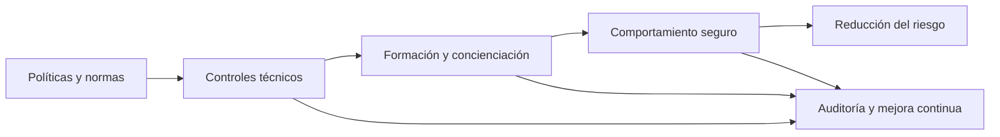
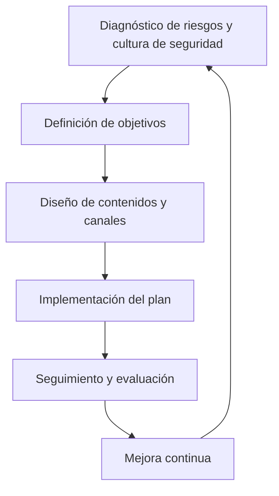
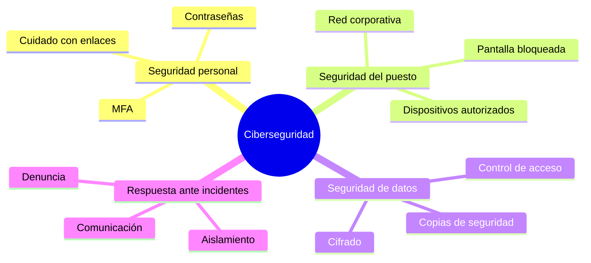
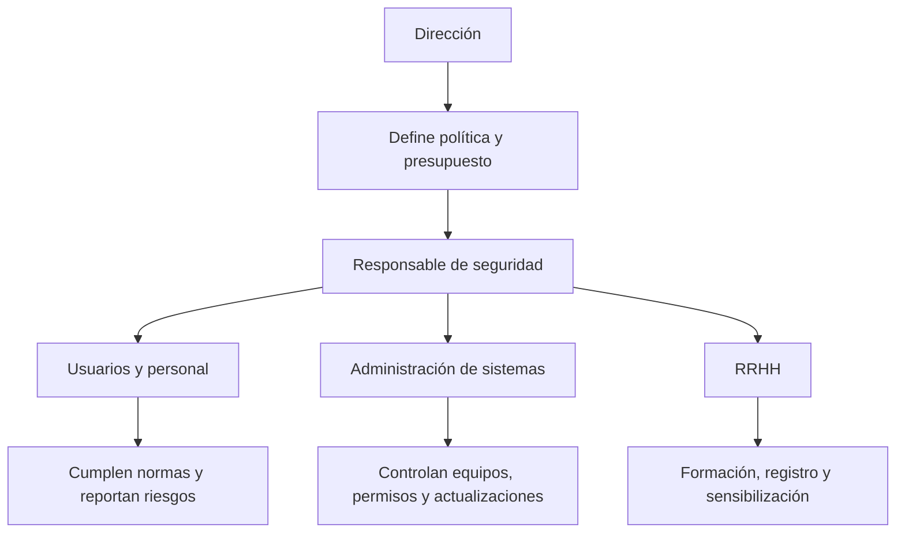
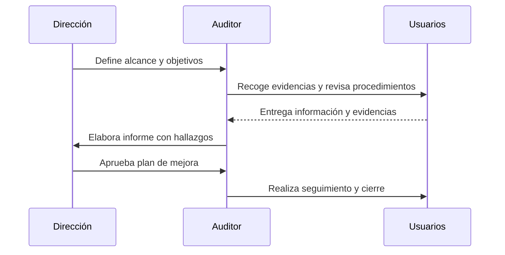

# UD1. Desarrollo de planes de prevención y concienciación en ciberseguridad

<p align="center">
  
</p>

<div align="center">


</div>

> La prevención es el primer escudo de la ciberseguridad. Antes de detectar y responder a un incidente, la organización debe construir una cultura de seguridad, definir normas claras, sensibilizar a las personas y comprobar que esas medidas se cumplen de forma continua.

## 1. Introducción a la unidad

Esta unidad aborda los fundamentos de la prevención en ciberseguridad y la importancia de la concienciación como elemento central de la seguridad organizativa. El objetivo no es solo instalar herramientas o redactar políticas, sino crear una cultura de seguridad que ayude a toda la organización a actuar con criterio, reducir riesgos y evitar incidentes.

La ciberseguridad no depende únicamente de sistemas y redes; depende también de las personas, sus comportamientos, sus decisiones y la calidad de las normas que guían su trabajo. Por esa razón, esta unidad combina:

- principios generales de ciberseguridad,
- normativa del puesto de trabajo,
- formación y concienciación,
- materiales de sensibilización,
- auditorías internas de cumplimiento.

La prevención en ciberseguridad es un proceso continuo de identificación de riesgos, diseño de controles, comunicación efectiva, educación y supervisión.

## 2. Resultado de aprendizaje y criterios asociados

### Resultado de aprendizaje 1

Desarrolla planes de prevención y concienciación en ciberseguridad, estableciendo normas y medidas de protección.

### Criterios de evaluación relacionados

1. Define y aplica principios generales de ciberseguridad.
2. Establece normas y medidas de protección del puesto de trabajo.
3. Diseña un plan de formación y concienciación en materia de ciberseguridad.
4. Elabora materiales de formación y concienciación.
5. Realiza auditorías internas de cumplimiento en materia de prevención.

### Relación entre contenidos y criterios

| Criterio | Contenido principal | Evidencia esperada |
| --- | --- | --- |
| 1 | Principios generales, riesgos, activos, vulnerabilidades, amenazas | Identificación y explicación de los principios y su aplicación al entorno laboral |
| 2 | Normativa de protección del puesto de trabajo | Política, procedimientos, controles básicos y buenas prácticas |
| 3 | Plan de formación y concienciación | Plan de sensibilización con objetivos, públicos, frecuencia y métodos |
| 4 | Materiales de formación | Presentaciones, infografías, phishing simulations, guías y checklists |
| 5 | Auditorías de cumplimiento | Revisiones, hallazgos, acciones correctivas y seguimiento |

## 3. Fundamentos de la prevención en ciberseguridad

### 3.1. Qué es la prevención en ciberseguridad

La prevención consiste en reducir la probabilidad de que un incidente ocurra, y en disminuir su impacto si ocurre. No se trata solo de poner antivirus; supone:

- entender los riesgos,
- definir políticas,
- controlar accesos,
- educar al personal,
- revisar procesos,
- probar medidas antes de que se materialice un ataque.

### 3.2. Activos, amenazas, vulnerabilidades y riesgos

Es clave distinguir estos conceptos:

- Activo: cualquier recurso sensible o crítico de valor para la organización (datos, equipo, redes, identidad, sistemas, procesos).
- Amenaza: cualquier evento o causa potencial que pueda afectar la seguridad de un activo.
- Vulnerabilidad: debilidad o fallo en un sistema, proceso o persona.
- Riesgo: combinación de la probabilidad de que una amenaza aproveche una vulnerabilidad y el impacto que tendría.

Ejemplo:

- Activo: sistema de gestión de clientes.
- Amenaza: phishing dirigido a empleados.
- Vulnerabilidad: usuarios con contraseñas débiles y cesión de credenciales.
- Riesgo: robo de datos de clientes y sanciones regulatorias.

### 3.3. Principios generales de la ciberseguridad

Los principios básicos que debe cumplir una organización son los siguientes:

#### 1. Confidencialidad

Los datos solo deben ser accesibles para personas autorizadas.

Ejemplo: información sanitaria, financiera o interna no debe compartirse por correo sin cifrado ni control de acceso.

#### 2. Integridad

Los datos y sistemas deben mantenerse exactos y protegidos frente a alteraciones no autorizadas.

Ejemplo: revisiones de cambios en archivos o acceso administrativo con trazabilidad.

#### 3. Disponibilidad

Los servicios y sistemas deben estar disponibles para los usuarios autorizados cuando se necesiten.

Ejemplo: copias de seguridad, redundancia, plan de continuidad y recuperación.

#### 4. Autenticación y control de acceso

Todo usuario debe identificarse correctamente y recibir los permisos mínimos necesarios.

Ejemplo: MFA, gestión de roles, segregación de funciones.

#### 5. Principio de mínimo privilegio

Un usuario debe tener solo los permisos necesarios para realizar su trabajo.

Ejemplo: un administrativo no necesita permisos de administrador del sistema.

#### 6. Seguridad por diseño

La seguridad debe incorporarse desde el inicio del diseño y desarrollo de sistemas y procesos.

Ejemplo: no dejar la seguridad para el final del proyecto.

#### 7. Concienciación y responsabilidad

Todos forman parte del sistema de seguridad.

Ejemplo: cada empleado debe reportar correos sospechosos y seguir políticas de uso.

### 3.4. Modelo de prevención: desde la política a la conducta



La prevención no se reduce a directivas escritas. Debe traducirse en comportamientos, hábitos, procedimientos y controles concretos.

### 3.5. La gestión del riesgo como base de la prevención

La gestión de riesgos es el eje sobre el que se diseña cualquier estrategia de prevención. No basta con detectar amenazas aisladas; es necesario comprender cómo interactúan los activos, las vulnerabilidades, la probabilidad de explotación y el impacto potencial sobre la organización.

Un análisis de riesgos suele comenzar por identificar los activos esenciales: información, sistemas, credenciales, dispositivos, procesos críticos, relaciones con proveedores y datos personales. A continuación, se examinan las amenazas que pueden afectar a esos activos (phishing, malware, errores humanos, fallos técnicos, acceso físico no autorizado, fraude interno o condiciones ambientales). Posteriormente se evalúan las vulnerabilidades, que pueden ser de naturaleza técnica, organizativa o conductual.

El riesgo se puede entender como la combinación de:

- probabilidad de que ocurra una amenaza,
- facilidad con la que esa amenaza aprovecha una vulnerabilidad,
- impacto sobre la continuidad del negocio, la reputación, la legalidad o la seguridad de las personas.

Por eso, la prevención debe priorizar los activos más críticos y aplicar medidas proporcionales al nivel de riesgo: controles preventivos, limitación del acceso, formación del personal y revisión periódica de los procedimientos.

### 3.6. Controles preventivos, detectivos y correctivos

Los controles de seguridad no tienen todos el mismo objetivo. Se suelen clasificar en tres grandes grupos:

#### a) Controles preventivos

Son los que buscan evitar que ocurra un incidente. Incluyen:

- políticas y normas de uso,
- autenticación multifactor,
- gestión de permisos,
- cifrado,
- copias de seguridad,
- actualización de software,
- formación y sensibilización.

#### b) Controles detectivos

Buscan identificar anomalías o señales de riesgo antes de que el daño sea grave. Entre ellos destacan:

- registros de auditoría,
- alarmas de seguridad,
- monitorización de redes,
- análisis de correos sospechosos y logs,
- simulaciones de seguridad.

#### c) Controles correctivos

Se activan cuando el incidente ya ha ocurrido y tienen como objetivo mitigar el impacto, recuperar el servicio y evitar que se repita. Algunos ejemplos son:

- aislamiento de equipos infectados,
- restauración desde copias de seguridad,
- revisión de accesos comprometidos,
- comunicación interna y coordinación con responsables,
- evaluación de lecciones aprendidas.

La política de seguridad más efectiva no se limita a un único tipo de control; requiere una combinación equilibrada entre prevención, detección y respuesta.

### 3.7. Cultura de seguridad y factor humano

La seguridad no depende solo de sistemas y herramientas. El factor humano es un elemento decisivo: puede actuar como primera línea de defensa o como punto de vulnerabilidad. Por ello, la prevención debe apoyarse en una cultura de seguridad que integre:

- responsabilidad compartida,
- conocimiento de riesgos habituales,
- normas claras y consistentes,
- comportamiento ético y proactivo,
- capacidad para detectar y denunciar incidentes.

La conciencia de seguridad se construye con la práctica. Un usuario bien formado no solo sabe qué medidas aplicar, sino que entiende por qué son necesarias y cómo afectan al conjunto de la organización. Es mucho más probable que una persona con cultura de seguridad identifique un phishing, no comparta credenciales, reporte un acceso sospechoso o mantenga un puesto de trabajo preparado para prevenir fallos.

### 3.8. Seguridad como proceso continuo, no como proyecto puntual

La prevención requiere continuidad. No basta con adoptar una política una vez y mantenerla olvidada; debe revisarse periódicamente. Las organizaciones cambian, los equipos evolucionan, aparecen nuevas amenazas, y cualquier norma debe adaptarse a nuevos contextos de trabajo, como el teletrabajo, el uso de dispositivos personales, la colaboración con terceros o el almacenamiento en la nube.

Por esa razón, la mejora continua es un principio esencial:

- revisar riesgos con frecuencia,
- actualizar procedimientos y políticas,
- evaluar la formación recibida,
- comparar resultados con indicadores de cumplimiento,
- ajustar acciones para cerrar brechas descubiertas por la auditoría.

## 4. Normativa y protección del puesto de trabajo

### 4.1. Importancia de la normativa interna

Toda organización debe definir normas claras sobre uso de dispositivos, gestión de credenciales, manejo de datos, uso de redes y protocolos de denuncia. La normativa no solo protege a la empresa, sino que empodera a la persona trabajadora y reduce errores costosos.

### 4.2. Recomendaciones para la normativa del puesto de trabajo

Se recomienda incluir, al menos, las siguientes áreas:

#### a) Uso de equipos y dispositivos

- No usar dispositivos personales para tareas sensibles sin autorización.
- Mantener sistemas actualizados.
- Bloquear pantallas al alejarse del puesto.
- No conectar USB o periféricos no autorizados.
- Usar la red corporativa y no redes públicas para trabajo confidencial.

#### b) Gestión de credenciales y acceso

- Contraseñas robustas y únicas por servicio.
- Activación de autenticación multifactor.
- No compartir contraseñas ni credenciales.
- Cambio inmediato ante sospecha de compromiso.

#### c) Manejo de datos y documentos

- Cifrado de archivos sensibles.
- Eliminación segura de documentos y dispositivos.
- No enviar información sensible por canales no autorizados.
- Control de copias de seguridad y archivado.

#### d) Seguridad física

- Control de accesos a instalaciones.
- Destrucción segura de documentación física.
- Protección de pantallas y cajones de trabajo.
- Vigilancia del entorno y uso de identificadores.

#### e) Comercio electrónico y correo

- Identificación de correos sospechosos.
- Verificación de remitentes y enlaces.
- No realizar transferencias bancarias sin doble validación.
- Denuncia de suplantación o intentos de fraude.

### 4.3. Ejemplo de política básica de seguridad

```text
POLÍTICA DE USO SEGURO DE DISPOSITIVOS

1. Todo usuario debe proteger su sesión con contraseña o autenticación biométrica.
2. No se utilizarán dispositivos no autorizados para acceder a información corporativa.
3. Se prohíbe la instalación de software sin autorización del departamento de sistemas.
4. Todo correo o mensaje extraño debe reportarse al responsable de seguridad.
5. Los datos sensibles solo podrán almacenarse en repositorios corporativos autorizados.
6. Se debe informar de cualquier sospecha de incidente inmediatamente.
```

### 4.4. Buenas prácticas de higiene digital en el puesto

- Actualizar el sistema operativo y la suite de oficina.
- Usar gestores de contraseñas.
- Mantener backups y verificar su restauración.
- Cerrar sesión cuando se abandona el puesto.
- Escanear documentos con herramientas de seguridad si procede.
- Mantener programas de oficina y navegadores actualizados.

### 4.5. Principios de diseño de una política interna de seguridad

Una política de seguridad debe ser clara, aplicable y verificable. No puede limitarse a un conjunto de recomendaciones abstractas; debe describir comportamientos esperados, responsabilidades y procedimientos de actuación concretos.

Un documento de política eficaz suele incluir:

- ámbito de aplicación,
- objetivos y alcance,
- responsables de la aplicación,
- estándares mínimos exigidos,
- prohibiciones y obligaciones,
- procedimiento de reporte de incidencias,
- periodicidad de revisión y mejora.

La política debe redactarse con un lenguaje accesible, orientado a la práctica, no técnico en exceso. Debe facilitar que la persona trabajadora comprenda qué puede hacer, qué está prohibido y qué debe hacer si detecta un riesgo o un incidente.

### 4.6. Normas, procedimientos y controles: relación entre ellos

Es importante distinguir entre norma, procedimiento y control:

- norma: establece lo que debe hacerse o no hacerse;
- procedimiento: describe cómo se lleva a cabo una tarea de forma segura;
- control: mecanismo, herramienta o medida técnica u organizativa para asegurar el cumplimiento.

Por ejemplo:

- norma: no se compartirán credenciales entre usuarios;
- procedimiento: si un usuario sospecha una cuenta comprometida, debe cambiar la contraseña y comunicarlo;
- control: MFA, gestión de accesos, bloqueo automático de sesión.

Una organización segura no se apoya solo en normas escrita; necesita procedimientos claros y controles operativos que hagan posible el cumplimiento real.

## 5. Principios de protección del puesto de trabajo

### 5.1. Seguridad física y digital del entorno laboral

La seguridad del puesto de trabajo incluye tanto la seguridad física del entorno como la protección del flujo digital. Un puesto seguro es aquel donde:

- la persona puede trabajar sin riesgo de observación indebida,
- los equipos están protegidos,
- los datos no se dejan expuestos,
- la sesión es segura,
- los procesos de acceso y salida están controlados.

### 5.2. Recomendaciones prácticas

- Pantalla orientada lejos de la vista ajena.
- Teclado y ratón con uso correcto y cuidado.
- Ordenador bloqueado al salir del puesto.
- Uso de funda o cierre de sesión en viajes.
- No dejar notas con contraseñas visibles.
- Uso de VPN o redes corporativas con seguridad adecuada.

### 5.3. Riesgos habituales en el puesto

- Dejar sesión iniciada.
- Reutilizar contraseñas personales en servicios laborales.
- Leer correos desde redes públicas sin protección.
- Instalar software no autorizado.
- Brindar información por teléfono a terceros no verificados.
- Descargar archivos de remitentes desconocidos.

## 6. Formación y concienciación en ciberseguridad

### 6.1. Por qué la concienciación es esencial

La concienciación no es solo informar. Es cambiar comportamientos. Muchas brechas de seguridad no se producen por ausencia de tecnología, sino por decisiones humanas: clicar enlaces sospechosos, compartir credenciales, no reportar un incidente, o usar dispositivos inseguros.

> La mejor defensa no siempre es técnica; muchas veces es humana, bien formada y bien guiada.

### 6.2. Objetivos del plan de concienciación

Un plan de formación debe conseguir que la persona:

- reconozca riesgos comunes,
- identifique amenazas y señales de alarma,
- siga normas de seguridad,
- informe de incidentes,
- adopte hábitos de trabajo seguros,
- contribuya a la mejora continua del negocio.

### 6.3. Públicos objetivo

El plan debe adaptarse a distintos perfiles:

- dirección y gerencia,
- personal administrativo,
- personal técnico,
- usuarios con acceso a datos sensibles,
- personal de atención al público,
- proveedores y terceros externos.

### 6.4. Fases de un plan de concienciación



### 6.5. Contenidos recomendados para la formación

- Conceptos básicos de ciberseguridad.
- Amenazas habituales: phishing, malware, ransomware, ingeniería social.
- Uso seguro de correo electrónico, navegación y redes.
- Protección de credenciales y autenticación.
- Gestión de dispositivos y USB.
- Seguridad física y protección de información.
- Procedimientos de denuncia y notificación de incidentes.

### 6.6. Metodología de formación eficaz

Se recomienda mezclar diferentes formatos:

- sesiones presenciales o virtuales,
- microformación breve,
- vídeos explicativos,
- cuestionarios,
- simulaciones de phishing,
- juegos o escenarios de seguridad,
- revisión de casos reales.

### 6.7. Ejemplo de plan anual de concienciación

| Mes | Tema | Canal | Objetivo |
| --- | --- | --- | --- |
| Septiembre | Seguridad básica y políticas | Formación inicial | Reforzar normas internas |
| Octubre | Phishing y redes sociales | Webinar + email | Reducir clics en enlaces sospechosos |
| Noviembre | Contraseñas y MFA | Taller práctico | Mejorar la gestión de credenciales |
| Diciembre | Seguridad física y dispositivos | Checklist | Reducir riesgos de acceso físico |
| Febrero | Protección de datos y RGPD | Formación | Fomentar responsabilidad en datos |
| Marzo | Simulación de phishing | Campaña interna | Evaluar comportamiento real |
| Mayo | Reporte de incidentes | Reunión de feedback | Mejorar la notificación temprana |

### 6.8. Diseño y evaluación de una campaña de concienciación

Un programa de sensibilización eficaz debe estar basado en objetivos concretos y medibles. El diseño correcto incluye:

- diagnóstico inicial del nivel de conocimiento y hábitos del personal,
- definición de objetivos específicos y realistas,
- segmentación por perfiles y responsabilidades,
- elección de formatos adecuados: vídeos, infografías, talleres, simulaciones, checklist,
- evaluación periódica para comprobar si se están produciendo cambios de comportamiento.

Los indicadores más útiles para valorar la eficacia de una campaña suelen ser:

- porcentaje de clics en correos simulados,
- número de reportes de mensajes sospechosos,
- tasa de cumplimento de políticas básicas,
- mejora en la calidad de respuestas ante incidentes,
- nivel de participación en cursos o sesiones,
- reducción de incidencias relacionados con errores humanos.

La medición del impacto es esencial: una campaña de concienciación que no se evalúa no puede afirmar que está aportando valor. La mejora real se demuestra cuando la conducta del personal cambia y se reducen los errores repetidos.

### 6.9. Principios didácticos para una formación efectiva

Para que la formación en seguridad sea útil debe cumplir criterios pedagógicos claros:

- ser breve y práctica,
- estar adaptada al perfil del destinatario,
- relacionar la teoría con casos reales,
- incluir ejemplos concretos de riesgo y respuesta,
- reforzar con ejercicios y seguimiento,
- repetir contenidos de forma periódica para consolidar hábitos.

Aprender ciberseguridad no consiste en memorizar definiciones; consiste en entrenar la capacidad de reconocer situaciones de riesgo, reaccionar con criterio y reportar problemas antes de que se conviertan en incidentes mayores.

## 7. Materiales de formación y concienciación

### 7.1. Tipos de materiales

Los materiales deben ser claros, prácticos y adaptados al perfil del receptor.

#### a) Guías de buenas prácticas

Documentos breves con reglas simples. Ejemplo:

- Cómo crear contraseñas seguras.
- Qué hacer con un correo sospechoso.
- Cómo mantener un equipo seguro.

#### b) Infografías

Muy útiles para resumir riesgos, señales de alarma y pasos a seguir.

#### c) Videos y microvideos

- una amenaza y su prevención,
- ejemplos reales y casos de estudio,
- explicaciones cortas sobre MFA, phishing o seguridad sensible.

#### d) Simulaciones y pruebas

- phishing simulation,
- cuestionarios de seguridad,
- ejercicios de análisis de correos y páginas web,
- simulación de respuesta ante un incidente.

#### e) Checklists de seguridad personal

Ejemplo:

```text
Checklist seguridad del puesto
[ ] Bloqueo automático de pantalla activo
[ ] Contraseñas únicas y complejas
[ ] MFA activado
[ ] Equipo actualizado
[ ] USB no conectados sin verificar
[ ] Correos sospechosos reportados
[ ] Sesión cerrada al salir
```

### 7.2. Ejemplo de infografía conceptual



### 7.3. Ejemplo de guía de uso seguro del correo

```text
Guía de correo seguro

- Verifica el remitente antes de abrir un archivo.
- Revisa siempre la URL antes de hacer clic.
- Si un mensaje pide urgencia o presión, sospecha.
- No compartas datos por correo si no es necesario.
- Si algo parece sospechoso, reporta antes que hacer clic.
```

## 8. Auditorías internas de cumplimiento en materia de prevención

### 8.1. Qué es una auditoría interna de cumplimiento

La auditoría interna es una revisión sistemática para verificar si la organización está aplicando correctamente las políticas, procedimientos y controles previstos. Se centra en comprobar que la prevención no es solo teórica, sino que se ejecuta de manera real.

### 8.2. Objetivos de la auditoría

- confirmar el cumplimiento de las políticas,
- detectar brechas o desviaciones,
- verificar que las medidas se aplican efectivamente,
- identificar oportunidades de mejora,
- asegurar trazabilidad y continuidad.

### 8.3. Ámbitos a auditar

- uso de dispositivos y acceso,
- gestión de credenciales,
- protección de datos,
- uso seguro de correo y navegación,
- formación y concienciación,
- registro de incidencias,
- cumplimiento de procedimientos.

### 8.4. Ejemplo de matriz de auditoría

| Aspecto | Requisito | Estado | Evidencia | Observación | Acción |
| --- | --- | --- | --- | --- | --- |
| Contraseñas | MFA activado | Cumple | Captura de configuración | Necesario reforzar formación | Mantener seguimiento |
| Correo | Política de phishing | Parcial | Simulación anual | Baja tasa de notificación | Realizar campaña | 
| Acceso | Mínimo privilegio | Cumple | Revisiones de permisos | Algunos usuarios con exceso de permisos | Reducir accesos |
| Copias de seguridad | Verificación periódica | No cumple | Registro incompleto | No se valida restauración | Implementar control |

### 8.5. Proceso de auditoría


### 8.6. Hallazgos típicos y medidas correctoras

#### Hallazgo 1: usuarios sin formación básica

- riesgo: clics en enlaces, phishing, uso inseguro de herramientas.
- acción: curso obligatorio y campaña trimestral.

#### Hallazgo 2: políticas no cumplidas por falta de sensibilización

- riesgo: incumplimiento de medidas básicas.
- acción: reforzar comunicación y evidenciar cumplimiento.

#### Hallazgo 3: permisos excesivos

- riesgo: impacto mayor si una cuenta se compromete.
- acción: revisión de privilegios y principio de mínimo privilegio.

#### Hallazgo 4: ausencia de notificación de incidentes

- riesgo: retraso en respuesta y mayor impacto.
- acción: crear canal claro y entrenamiento en denuncia.

### 8.7. Tipos de auditoría y su utilidad en la prevención

La auditoría internal no solo verifica cumplimiento; también ayuda a mejorar el diseño de los controles y a detectar debilidades en la cultura organizativa. Según el objetivo, pueden distinguirse varios tipos:

- auditoría de cumplimiento: comprueba si se siguen normas y procedimientos;
- auditoría de control interno: valora si los controles diseñados son suficientes;
- auditoría de seguridad operativa: revisa configuración de equipos, redes, accesos y uso de herramientas;
- auditoría de formación y conciencia: analiza si el personal tiene capacidad real para aplicar buenas prácticas.

La auditoría debe producir evidencia objetiva: registros, capturas, permisos, informes, formularios de formación y hallazgos documentados. La utilidad del proceso no está en detectar errores aislados, sino en generar un plan de mejora con prioridad, responsables y plazos.

### 8.8. Métricas básicas de cumplimiento

Para saber si la prevención funciona, es útil medir indicadores como:

- porcentaje de usuarios con MFA habilitado,
- número de accesos no autorizados detectados,
- tasa de clics en simulacros de phishing,
- porcentaje de personal con formación actualizada,
- número de incidencias reportadas y cerradas,
- cumplimiento de revisiones periódicas de permisos.

Estos indicadores permiten pasar de una gestión intuitiva a una gestión basada en datos y evidencia, lo que facilita la toma de decisiones y la priorización de acciones.

## 9. Técnicas y procedimientos de prevención comunes

### 9.1. Seguridad operativa básica

- mantener actualizados equipos y software,
- activar firewall y protección antimalware,
- desactivar servicios innecesarios,
- controlar accesos con autentificación fuerte,
- aplicar políticas de cifrado,
- realizar copias de seguridad periódicas.

### 9.2. Seguridad en entornos compartidos

Cuando varias personas usan un mismo entorno, se debe reforzar:

- permisos específicos por rol,
- control de acceso físico,
- trazabilidad de cambios,
- gestión de sesiones,
- separación entre trabajo personal y profesional.

### 9.3. Seguridad en telecomunicaciones y redes

- evitar compartir credenciales por chat o correo,
- usar conexión corporativa o VPN,
- verificar la identidad del soporte técnico antes de facilitar acceso,
- utilizar redes seguras, no públicas, para tareas sensibles.

### 9.4. Seguridad de datos sensibles

Se deben considerar:

- clasificación de información,
- cifrado según nivel de sensibilidad,
- almacenamiento controlado,
- acceso limitado,
- eliminación segura,
- registro de movimientos.

## 10. Ejemplos prácticos para el aula

### 10.1. Ejemplo de análisis de riesgo sencillo

Supongamos que una empresa tiene 200 empleados y un sistema de RRHH con datos de empleados.

#### Riesgo identificado

- Amenaza: phishing masivo.
- Vulnerabilidad: no se aplica MFA y muchos usuarios reutilizan contraseñas.
- Impacto: robo de credenciales, acceso a datos personales, sanciones, reputational damage.
- Probabilidad: media-alta.

#### Medidas de prevención

- MFA obligatoria para todas las cuentas.
- Módulo de formación mensual sobre phishing.
- Simulación trimestral de phishing.
- Política de contraseñas y gestor de contraseñas.
- Informe trimestral de auditoría de cumplimiento.

### 10.2. Ejemplo de procedimiento de respuesta frente a un correo sospechoso

```text
Si recibes un correo sospechoso:
1. No lo abras ni hagas clic en enlaces.
2. Comprueba remitente y dominio.
3. No respondas ni descargues archivos.
4. Reporta el mensaje al departamento de seguridad.
5. Si ya has hecho clic, notifica de inmediato y cambia credenciales.
```

### 10.3. Ejemplo de script básico de seguridad en equipo

Este ejemplo en Bash ayuda a comprobar la configuración básica de un equipo Linux:

```bash
#!/bin/bash

echo "Verificando seguridad básica del equipo..."

# Contraseñas y políticas de sesión
grep -E "^PASS_MAX_DAYS|^PASS_MIN_DAYS|^PASS_WARN_AGE" /etc/login.defs

# Usuarios con shell interactiva
awk -F: '$7 != "/usr/sbin/nologin" && $7 != "/bin/false" {print $1, $7}' /etc/passwd

# Servicios activos innecesarios
systemctl list-units --type=service --state=running --no-pager

# Actualización del sistema
apt update -qq
apt list --upgradable

echo "Revisión completada. Revisar usuarios y servicios innecesarios."
```

### 10.4. Ejemplo de validación de contraseña en Python

```python
import re


def password_valida(password: str) -> bool:
    if len(password) < 12:
        return False
    if not re.search(r'[A-Z]', password):
        return False
    if not re.search(r'[a-z]', password):
        return False
    if not re.search(r'[0-9]', password):
        return False
    if not re.search(r'[^A-Za-z0-9]', password):
        return False
    return True

for p in ["Abcdef1!xyz", "contraseña", "Admin123!", "Qwerty123!"]:
    print(p, "->", password_valida(p))
```

### 10.5. Ejemplo de checklist de seguridad para un puesto de trabajo

```text
CHECKLIST DIARIO
[ ] Pantalla bloqueada al alejarse
[ ] Sesión cerrada al final del turno
[ ] Contraseñas no compartidas
[ ] Correo sospechoso reportado
[ ] USBs verificados antes de usarse
[ ] Software autorizado instalado
[ ] Acceso solo al entorno necesario
```

### 10.6. Mapa de riesgos y controles en un puesto de trabajo

Un buen plan de prevención requiere saber qué riesgos existen, quién es responsable y qué control los mitiga. La siguiente tabla ayuda a visualizarlo:

| Riesgo | Origen | Impacto potencial | Control preventivo | Responsable |
| --- | --- | --- | --- | --- |
| Phishing | Mensaje fraudulento | Robo de credenciales | Formación, MFA, simulacros | Seguridad / RRHH |
| Uso de USB no autorizada | Dispositivo externo | Malware y pérdida de datos | Política, escaneo y bloqueo | Sistemas |
| Contraseña débil | Comportamiento humano | Acceso no autorizado | Política de contraseñas y gestor | Usuarios / Seguridad |
| Sesión abierta | Descuido del usuario | Uso indebido de la cuenta | Bloqueo automático y buenas prácticas | Usuarios |
| Acceso excesivo | Falta de control de permisos | Exposición de datos | Mínimo privilegio y revisión periódica | Dirección / Sistemas |
| Fuga de datos sensibles | Uso incorrecto del correo | Incumplimiento normativo | Cifrado, control de acceso y política | Responsable de datos |

### 10.7. Caso práctico: diseño de un plan de prevención para una pequeña empresa

Imaginemos una PYME con 30 empleados, 10 ordenadores, software de gestión y datos de clientes. El responsable de seguridad quiere establecer una política simple, realista y efectiva.

#### Diagnóstico inicial

- Hay una red Wi-Fi compartida por todos.
- Los empleados usan la misma contraseña para varias aplicaciones.
- No existen políticas claras sobre uso de correo corporativo.
- No se hace ninguna simulación de phishing.
- Los permisos de acceso se asignan sin revisión periódica.

#### Objetivos del plan

- reducir la probabilidad de acceso no autorizado,
- disminuir la exposición de datos,
- mejorar la respuesta ante incidentes,
- reforzar la cultura de seguridad.

#### Medidas propuestas

1. Crear una política de seguridad con reglas básicas de uso del correo, dispositivos, credenciales y datos.
2. Establecer MFA para todos los servicios críticos.
3. Crear un checklist de seguridad del puesto.
4. Introducir una campaña trimestral de formación.
5. Revisar permisos de acceso cada 6 meses.
6. Configurar bloqueo automático de pantalla.
7. Reforzar la detección de correos sospechosos.
8. Documentar incidentes y resolverlos con un protocolo claro.

#### Resultado esperado

La organización pasa de una cultura informal y poco segura a una cultura orientada a la prevención, con responsabilidades definidas y procesos repetibles.

### 10.8. Roles y responsabilidades en la prevención

La prevención no se puede limitar a una persona. Debe existir un reparto de responsabilidades en toda la organización.



- Dirección: define prioridades, recursos y compromiso institucional.
- Responsable de seguridad: diseña políticas, audita y supervisa.
- Usuarios: aplican buenas prácticas y denuncian anomalías.
- RRHH: incorpora formación y seguimiento del personal.
- Sistemas: implementa controles técnicos y revisa configuraciones.

### 10.9. Protocolo de prevención mínima recomendada

```text
1. Identificar activos y riesgos clave.
2. Definir normas básicas de uso.
3. Establecer controles técnicos y organizativos.
4. Formar a usuarios y personal clave.
5. Revisar cumplimiento periódicamente.
6. Registrar incidencias y mejorar la respuesta.
```

## 11. Marco normativo, legal y ético en la prevención

### 11.1. Relación entre seguridad y cumplimiento

La prevención no es solo técnica: tiene una dimensión legal y organizativa. Las organizaciones deben cumplir requisitos en materia de protección de datos, privacidad, continuidad de negocio y buenas prácticas de información.

### 11.2. Normativa y principios relevantes

- Protección de datos personales: las organizaciones deben limitar la recogida, tratamiento y acceso a información personal.
- Principio de seguridad: toda información sensible debe protegerse con medidas adecuadas.
- Principio de trazabilidad: las operaciones relacionadas con seguridad deben poder justificarse y revisarse.
- Principio de responsabilidad proactiva: la entidad debe anticiparse a riesgos y contar con procedimientos.

### 11.3. Ejemplo de análisis de cumplimiento

| Requisito | Situación posible | Riesgo | Medida preventiva |
| --- | --- | --- | --- |
| Acceso restringido a datos sensibles | Más de una persona tiene acceso | Fuga de información | Mínimo privilegio |
| Cifrado de documentos sensibles | Archivos sin cifrar | Robo o exposición | Política de cifrado |
| Formación periódica | Sólo una formación anual | Baja concienciación | Curso trimestral |
| Registro de incidencias | No se documentan | Falta de aprendizaje | Protocolo de reporte |

### 11.4. Qué implica la responsabilidad en ciberseguridad

La prevención requiere que la organización asuma una responsabilidad compartida:

- la dirección define el nivel de riesgo aceptable,
- el responsable de seguridad aplica políticas,
- el usuario actúa con criterio y reporta incidencias,
- los proveedores y terceros deben respetar los mismos estándares.

### 11.5. Relación entre prevención, ética y cumplimiento legal

La ciberseguridad no es únicamente una cuestión técnica ni de cumplimiento formal; también tiene un componente ético. Una organización que protege datos, respeta la privacidad y toma decisiones proporcionales a los riesgos está ayudando a proteger a las personas y a sus derechos. La prevención debe evitar prácticas excesivamente invasivas o arbitrarias, y debe estar alineada con los principios de proporcionalidad, necesidad y trazabilidad.

En términos legales, la prevención se conecta con varias obligaciones: protección de datos personales, continuidad del servicio, privacidad, seguridad de la información, trazabilidad de decisiones y obligación de notificación ante incidencias relevantes. Una política de seguridad bien diseñada no solo reduce riesgos, sino que refuerza la confianza y la legitimidad de la organización.

## 12. Planificación de una auditoría interna de cumplimiento

### 12.1. Objetivo

La auditoría interna ayuda a comprobar si las medidas de prevención se están aplicando y si la organización cumple con la normativa y las políticas definidas.

### 12.2. Fases



### 12.3. Lista de verificación de auditoría

- políticas accesibles y actualizadas,
- formación registrada,
- MFA activado en cuentas críticas,
- permisos revisados,
- correo corporativo con filtrado,
- gestión de contraseñas y backups,
- procedimiento de notificación de incidentes,
- registro de incidencias.

## 13. Ejercicios de consolidación avanzados

### Ejercicio 7. Reducción de riesgos en un entorno escolar

Una escuela usa tablets para alumnado y un ordenador central para gestión administrativa. El personal no lleva a cabo formación sobre seguridad. ¿Qué medidas de prevención aplicarías en 1 mes?

#### Solución orientativa

- restringir acceso de alumnado a dispositivos administrativos,
- activar autenticación multifactor para administración,
- limitar la instalación de software,
- formatear una campaña de seguridad para docentes y alumnos,
- establecer guías de uso seguro de correo y navegación.

### Ejercicio 8. Evaluación de una campaña de concienciación

Se ha lanzado una campaña de 3 semanas con infografías y un simulacro de phishing. La tasa de clics inicial era del 38 %, tras la campaña baja al 11 %. ¿Qué indicadores se deberían revisar?

#### Solución orientativa

- porcentaje de clics,
- usuarios que reportaron el correo,
- porcentaje de errores de seguridad aprendidos,
- seguimiento de la formación,
- mejora en la respuesta ante aumentos de phishing.

### Ejercicio 9. Diseño de una política de seguridad para una oficina híbrida

Imagina una organización con trabajo híbrido. Diseña una normativa básica para:

- uso de dispositivos personales,
- acceso remoto,
- almacenamiento de archivos,
- manejo de mensajes,
- control de sesiones.

#### Solución orientativa

```text
- Los equipos personales deben cumplir requisitos mínimos de seguridad.
- El acceso remoto solo se realizará mediante VPN y autenticación reforzada.
- Los archivos sensibles se almacenarán en repositorios corporativos cifrados.
- Las conversaciones que contengan datos sensibles deben ir por canales autorizados.
- Las sesiones deben cerrarse al salir del puesto e iniciarse con MFA.
```

## 14. Actividades de portfolio o entrega

Estas tareas son muy útiles para evaluar la adquisición de competencias:

### Actividad A. Elaborar una política de seguridad básica

Entrega: 1 documento breve con estructura, objetivos, normas y responsables.

### Actividad B. Diseñar una mini campaña de concienciación

Entrega: 1 infografía, 1 checklist y 1 breve presentación de 5 minutos.

### Actividad C. Auditar un puesto de trabajo

Entrega: una matriz con riesgos, controles y recomendaciones de mejora.

### Actividad D. Redactar un informe de hallazgos

Entrega: un documento con nivel de cumplimiento, evidencias y acciones de mejora.

## 15. Resumen didáctico final de la unidad

La Unidad 1 demuestra que la ciberseguridad no comienza con herramientas, sino con la organización y la persona. La prevención se materializa en políticas claras, formación efectiva, auditorías reales y un compromiso institucional por parte de toda la organización.

Los elementos esenciales son:

- identificación y análisis de riesgos,
- control de accesos y gestión de permisos,
- cultura de seguridad y comportamiento responsable,
- formación y concienciación continuada,
- vigilancia del cumplimiento y mejora continua.

Cuando estas prácticas se internalizan, la organización no solo reduce riesgos, sino que mejora su capacidad de afrontar incidentes con mayor preparación y menor impacto.

## 16. Bibliografía recomendada ampliada

- ENISA: Awareness Raising materials and good practices.
- INCIBE: Guías de seguridad para empresas y ciudadanía.
- NIST: Cybersecurity Framework.
- ISO/IEC 27001.
- Reglamento (UE) 2016/679 (RGPD).
- Ley Orgánica 3/2018 de Protección de Datos y garantía de derechos digitales.

## 17. Plantillas de entrega para alumnado

### Plantilla A. Análisis de riesgo básico

```text
Activo:
Amenaza:
Vulnerabilidad:
Riesgo:
Probabilidad:
Impacto:
Medidas preventivas:
Responsable:
```

### Plantilla B. Política de uso seguro

```text
Nombre de la política:
Objetivo:
Ámbito:
Normas principales:
Responsables:
Frecuencia de revisión:
```

### Plantilla C. Plan de concienciación

```text
Público objetivo:
Temas:
Objetivos:
Recursos:
Cronograma:
Indicadores de éxito:
```

### Plantilla D. Informe de auditoría

```text
Área:
Requisito:
Estado:
Evidencia:
Hallazgo:
Acción correctiva:
Plazo:
Responsable:
```

## 18. Autoevaluación final ampliada

1. ¿Qué diferencia hay entre un incidente y un riesgo no controlado?
2. ¿Qué principios básicos debe respetar una política de seguridad?
3. ¿Qué medidas de prevención usarías ante phishing masivo?
4. ¿Por qué el principio de mínimo privilegio es esencial?
5. ¿Qué información debe incluir una auditoría interna?
6. ¿Cómo se puede medir la eficacia de un plan de concienciación?
7. ¿Qué papel juega la dirección en la seguridad?
8. ¿Qué factores convierten una norma en una práctica efectiva y no solo teórica?

Si eres capaz de responder con criterio a estas preguntas, ya has adquirido una base sólida para la prevención y la concienciación en ciberseguridad.

---

<p align="center">
  <strong>La prevención en ciberseguridad es un ecosistema de personas, procesos y tecnología. Cuando todas estas piezas trabajan juntas, la organización se vuelve más resistente.</strong>
</p>

## 11. Ejercicios de consolidación

### Ejercicio 1. Identifica la vulnerabilidad

Una empresa permite a sus empleados usar el mismo correo personal para acceder a servicios corporativos y no exige MFA. ¿Qué riesgos aparecen? ¿Qué medidas de prevención aplicarías?

#### Solución orientativa

Riesgos:

- robo de credenciales,
- acceso no autorizado a datos,
- suplantación de identidad,
- propagación de malware,
- pérdida de confidencialidad y reputación.

Medidas:

- MFA obligatorio,
- prohibir el uso de correo personal,
- políticas de acceso por rol,
- formación sobre phishing,
- auditoría de accesos.

### Ejercicio 2. Diseño de una política de seguridad básica

Redacta una política que regule:

- uso del correo corporativo,
- protección de credenciales,
- uso de dispositivos personales,
- gestión de información sensible,
- respuesta ante mensajes sospechosos.

#### Solución orientativa

```text
1. El correo corporativo se usará exclusivamente para actividades laborales.
2. No se compartirán credenciales ni se almacenarán en documentos no seguros.
3. El uso de dispositivos personales requiere autorización previa y cumplimiento de seguridad.
4. Los datos sensibles se manejarán en sistemas autorizados y cifrados.
5. Todo correo sospechoso debe ser reportado sin abrir enlaces ni archivos adjuntos.
```

### Ejercicio 3. Realiza una auditoría simple

Con la siguiente información, determina qué aspectos se cumplen y cuáles no:

- 90 % del personal usa contraseñas únicas.
- MFA está activado en 60 % de las cuentas administrativas.
- Se realiza formación anual sobre phishing.
- No existe revisión de permisos desde hace 8 meses.
- El 30 % de usuarios comparte acceso a una plataforma interna.

#### Solución orientativa

Cumple parcialmente:

- buenas prácticas en contraseñas, pero no todas;
- MFA incompleto;
- formación anual, pero insuficiente si no es periódica;
- revisión de permisos ausente;
- acceso compartido altamente crítico.

Conclusión: la organización presenta brechas importantes en prevención y control de acceso.

### Ejercicio 4. Caso práctico: correo de suplantación

Un empleado recibe un mensaje con apariencia de dirección de la empresa y un enlace que pide verificar credenciales. ¿Qué debe hacer?

#### Solución orientativa

- no hacer clic,
- confirmar con el remitente real,
- no responder al mensaje,
- reportarlo al responsable de seguridad,
- si ya se hizo clic, cambiar contraseña y avisar al departamento.

### Ejercicio 5. Elaboración de un plan de concienciación

Crea un plan de 4 sesiones para un centro educativo o empresa pequeña.

#### Solución orientativa

| Sesión | Tema | Objetivo |
| --- | --- | --- |
| 1 | Principios básicos | Entender que la seguridad es responsabilidad de todas las personas |
| 2 | Contraseñas y MFA | Mejorar protección de credenciales |
| 3 | Phishing y redes sociales | Identificar amenazas y comportamientos inseguros |
| 4 | Denuncia e incidentes | Aprender a reportar y actuar de forma ágil |

### Ejercicio 6. Evaluación de riesgos básicos

Enumera tres riesgos de seguridad y las medidas preventivas correspondientes.

#### Solución orientativa

| Riesgo | Impacto | Medida preventiva |
| --- | --- | --- |
| Phishing | Robo de credenciales | Formación y simulaciones |
| USB infectados | Malware | Política de uso y escaneo |
| Acceso compartido | Exposición de datos | Control de permisos y MFA |

## 12. Actividades prácticas recomendadas

### Actividad 1. Análisis de una política interna

Objetivo: revisar una política de seguridad y detectar vacíos.

Pasos:

1. Leer un ejemplo de política.
2. Identificar los puntos faltantes.
3. Proponer mejoras con criterio técnico y organizativo.

### Actividad 2. Simulación de phishing

Objetivo: detectar la vulnerabilidad humana.

Pasos:

1. Preparar un correo ficticio con un enlace sospechoso.
2. Enviar a los estudiantes o compañeros con consentimiento.
3. Medir cuántos usuarios lo abren o clican.
4. Discutir la respuesta y reforzar la formación.

### Actividad 3. Diseño de una campaña de concienciación

Objetivo: generar materiales visuales y formativos.

Resultado esperado:

- cartel o infografía,
- checklist de seguridad,
- presentación breve,
- plan de seguimiento.

### Actividad 4. Auditoría de cumplimiento en miniatura

Objetivo: revisar si se siguen las normas.

Elementos a comprobar:

- políticas públicas y accesibles,
- formación actualizada,
- MFA activo,
- permisos revisados,
- canales de denuncia visibles.

## 13. Criterios de éxito de la unidad

Un estudiante habrá comprendido esta unidad si es capaz de:

- explicar por qué la prevención es esencial en ciberseguridad,
- identificar los principales principios de seguridad,
- establecer una normativa básica de protección del puesto de trabajo,
- diseñar materiales y actividades de concienciación,
- valorar el cumplimiento de una organización en materia de seguridad,
- proponer medidas correctoras y acciones de mejora continua.

## 14. Error frecuente a evitar

Uno de los principales errores de esta unidad es pensar que la seguridad se limita a comprar software o instalar antivirus. La parte más crítica es la dimensión humana y organizativa: normas claras, cultura de seguridad, formación continua y auditoría real del cumplimiento.

## 15. Resumen final

La prevención y la concienciación son la base de cualquier estrategia sólida de ciberseguridad. Una organización puede disponer de herramientas sofisticadas, pero si sus personas no conocen las normas, no reportan incidentes ni no aplican buenas prácticas, la seguridad sigue siendo frágil.

En esta unidad se ha visto que:

- la seguridad debe estar integrada en el puesto de trabajo,
- la normativa interna debe ser clara y aplicable,
- la formación debe ser activa y continuada,
- la concienciación debe provocar cambios de comportamiento,
- la auditoría permite comprobar que las medidas realmente funcionan.

La prevención no es un proyecto puntual; es una disciplina permanente que se reforza con educación, control y mejora continua.

## 16. Bibliografía y recursos recomendados

### Bibliografía básica

- ENISA. Good practices for cybersecurity awareness raising.
- ISO/IEC 27001: Information security management systems.
- Reglamento General de Protección de Datos (RGPD).
- Ley Orgánica de Protección de Datos Personales y garantía de los derechos digitales (LOPDGDD).
- NIST Cybersecurity Framework.

### Recursos web recomendados

- ENISA: https://www.enisa.europa.eu
- INCIBE: https://www.incibe.es
- CISA: https://www.cisa.gov
- OWASP: https://owasp.org

### Materiales para el aula

- presentaciones breves,
- infografías,
- cuestionarios de phishing,
- checklist de seguridad,
- casos de estudio reales adaptados.

## 17. Plantillas útiles para el alumnado

### Plantilla 1. Política de seguridad básica

```text
TÍTULO: Política de seguridad del puesto de trabajo

Objetivo
- Proteger la información, equipos y servicios de la organización.

Normas
- Uso de equipos autorizados.
- Contraseñas seguras y MFA.
- No compartir credenciales.
- Denuncia inmediata de incidentes.
- Manejo seguro de datos sensible.
```

### Plantilla 2. Plan de formación del mes

```text
Tema:
Objetivo:
Público:
Duración:
Metodología:
Recursos:
Evaluación:
```

### Plantilla 3. Informe de auditoría simple

```text
Área auditada:
Requisito:
Cumplimiento:
Evidencia:
Hallazgo:
Acción correctiva:
Responsable:
Fecha prevista:
```

## 18. Autoevaluación final

Responde estas preguntas para comprobar tu nivel de comprensión:

1. ¿Qué diferencia existe entre amenaza, vulnerabilidad y riesgo?
2. ¿Por qué la concienciación es un control esencial de seguridad?
3. ¿Qué elementos debería incluir una política de seguridad del puesto de trabajo?
4. ¿Qué tipos de materiales son eficaces para sensibilizar a una organización?
5. ¿Qué aspectos se revisan en una auditoría interna de cumplimiento?
6. ¿Cómo se debería actuar ante un correo sospechoso?
7. ¿Qué significa el principio de mínimo privilegio?
8. ¿Por qué la seguridad debe incluirse desde el diseño de procesos y sistemas?

Si puedes responder claramente a estas preguntas, has adquirido una base sólida para la prevención y la concienciación en ciberseguridad.

---

<p align="center">
  <strong>UD1 concluida: prevención y concienciación como base de la ciberseguridad efectiva.</strong>
</p>
