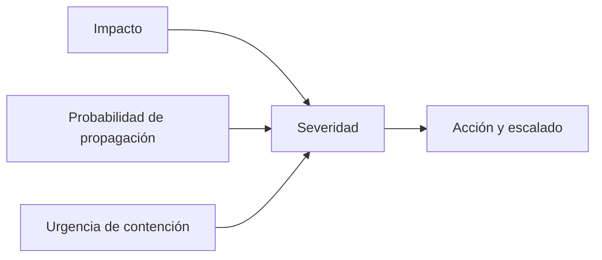

# UD2. Auditoría de incidentes de ciberseguridad

<p align="center">
  
</p>

<div align="center">


</div>

> La auditoría y la detección son la base de una respuesta efectiva: si no sabemos qué está ocurriendo, no podemos priorizar ni reaccionar con criterio. La segunda unidad se centra en la identificación, monitorización, clasificación y valoración inicial de los incidentes.

## 1. Introducción a la unidad

La auditoría de incidentes de ciberseguridad constituye una disciplina esencial dentro del ciclo de seguridad de la información, ya que permite identificar, validar, clasificar y priorizar los eventos que pueden comprometer la confidencialidad, integridad y disponibilidad de los activos organizativos. Esta unidad aborda de forma integrada la taxonomía de incidentes, la monitorización de señales de seguridad, la detección de anomalías, la revisión de elementos físicos y el uso de fuentes abiertas para la investigación inicial.

Desde un enfoque académico, la auditoría de incidentes no se limita a reaccionar ante alertas aisladas, sino que exige interpretar la evidencia disponible, contextualizar el evento dentro del entorno operativo y decidir con criterio si dicho suceso constituye un incidente de seguridad o un dato sin relevancia inmediata. El aprendizaje de esta unidad pretende dotar al alumnado de capacidades para transformar eventos y alertas en información útil para la toma de decisiones, la contención temprana y la preparación de una respuesta técnica y organizativa.

## 2. Resultado de aprendizaje y criterios

### Resultado de aprendizaje 2

Analiza incidentes de ciberseguridad mediante herramientas, mecanismos de detección, alertas de seguridad y procedimientos de valoración inicial.

### Criterios de evaluación

1. Clasifica la taxonomía de incidentes de ciberseguridad.
2. Establece controles, herramientas y mecanismos de monitorización, identificación, detección y alerta.
3. Detecta incidentes de seguridad física.
4. Aplica herramientas OSINT para la identificación e investigación inicial.
5. Realiza la clasificación, valoración y seguimiento inicial de incidentes.

## 3. Conceptos fundamentales

### 3.1. Evento, alarma e incidente

El análisis de incidentes exige diferenciar con precisión tres conceptos relacionados pero no equivalentes:

- Evento: hecho observable que puede ser relevante para la seguridad y que genera datos susceptibles de ser registrados.
- Alerta: señal de anomalía, generalmente derivada de una regla, umbral o patrón detectado por una herramienta de seguridad.
- Incidente: evento que tiene impacto real o potencial sobre la seguridad de la organización, sobre un activo o sobre la continuidad del servicio.

Ejemplo:

- evento: un equipo intenta conectarse a un servicio con múltiples credenciales fallidas;
- alarma: el SIEM genera una alerta asociada a intentos de fuerza bruta;
- incidente: si el ataque tiene éxito y se produce acceso a una cuenta con privilegios administrativos o se altera una configuración crítica.

### 3.2. Taxonomía de incidentes

La taxonomía permite estructurar la clasificación de los incidentes con criterios homogéneos. Los incidentes pueden categorizarse atendiendo a:

- tipo de amenaza: malware, phishing, ransomware, acceso no autorizado, denegación de servicio, abuso de privilegios;
- vector de ataque: red, correo, endpoint, servicio web, dispositivos móviles, redes sociales;
- impacto: confidencialidad, integridad, disponibilidad;
- origen: interno, externo, proveedor, tercero, usuario autorizado;
- severidad: leve, moderado, alta, crítica.

La clasificación no es meramente descriptiva; sirve para priorizar la respuesta, asignar responsabilidades y determinar la necesidad de escalado.

### 3.3. Tipos de incidentes más frecuentes

```text
- Malware y ransomware
- Phishing y suplantación de identidad
- Acceso no autorizado a sistemas o cuentas
- Exfiltración de información
- Denegación de servicio
- Abuso de privilegios
- Manipulación o corrupción de datos
- Seguridad física: accesos indebidos, robo de dispositivos o usos no autorizados
- Uso indebido de redes, servicios y recursos corporativos
```

### 3.4. Seguridad operativa y análisis de incidentes

Aunque ambas disciplinas están relacionadas, no deben confundirse. La seguridad operativa se orienta a mantener los sistemas protegidos, configurados y funcionando de forma segura; la auditoría y el análisis de incidentes se centran en interpretar los eventos, distinguir patrones de anomalía y decidir si un suceso requiere respuesta formal.

Durante la fase inicial del análisis es necesario discriminar entre:

- ruido operativo normal,
- anomalías sin impacto real,
- eventos que requieren validación,
- incidentes con riesgo de propagación o daño.

Esta distinción es esencial, porque una alerta aislada puede corresponder a una prueba de seguridad, a una actividad legítima o a un incidente real. El análisis debe evitar, por un lado, la alarma excesiva y, por otro, la inacción ante señales que demuestren riesgo real.

### 3.5. Flujo general del tratamiento de un incidente

El tratamiento de un incidente suele desarrollarse en una secuencia lógica que comprende:

1. detección,
2. validación y corroboración,
3. clasificación inicial,
4. contención,
5. investigación técnica,
6. recuperación,
7. lecciones aprendidas.

La auditoría inicial ocupa la primera parte del flujo y resulta crucial para decidir si un evento debe gestionarse como incidente y qué nivel de prioridad merece en ese momento.

### 3.6. Evidencia, trazabilidad y documentación

La gestión de incidentes debe apoyarse en evidencia objetiva. Los datos que sustentan la investigación pueden incluir logs del sistema, trazas de red, registros de autenticación, cambios de configuración, actividades de procesos, archivos sospechosos, pruebas de malware, registros de acceso, evidencia de seguridad física y documentos de seguimiento.

La trazabilidad es un principio fundamental porque permite:

- reconstruir la secuencia temporal de los hechos,
- diferenciar causa y consecuencia,
- justificar las decisiones de contención,
- respaldar informes internos o externos,
- analizar patrones y mejorar la seguridad a medio y largo plazo.

La documentación no es una tarea secundaria; es una prueba de rigor metodológico y una garantía de continuidad operativa.

## 4. Monitorización y detección

### 4.1. Definición de monitorización

La monitorización consiste en supervisar continuamente sistemas, servicios, usuarios y redes con el propósito de detectar comportamientos anómalos, cambios de estado o señales de riesgo. En un contexto de seguridad, la monitorización combina la recopilación de eventos, la correlación de datos y la interpretación contextual de señales.

### 4.2. Fuentes de información

Las principales fuentes de información para la auditoría de incidentes son:

- logs del sistema operativo;
- registros de firewall y IDS/IPS;
- registros de antivirus y EDR;
- trazas de correo electrónico y proxies web;
- servicios de autenticación y VPN;
- telemetría de red y endpoints;
- resultados de control de accesos y de integridad del sistema.

### 4.3. Herramientas de monitorización

Las herramientas más habituales en este ámbito incluyen:

- SIEM: correlación de eventos y alertas;
- EDR: análisis del comportamiento de endpoints y procesos;
- IDS/IPS: detección de tráfico sospechoso o actividades maliciosas;
- firewall y proxy: control del tráfico y análisis de conexiones;
- NAC o control de acceso: validación de dispositivos y conexiones según política;
- monitorización de activos: supervisión de CPU, memoria, red e integridad.

### 4.4. Modelos de detección

La detección puede clasificarse de forma general en tres modelos:

- detección basada en firmas: identifica patrones conocidos ya asociados a malware o amenazas conocidas;
- detección basada en anomalías: compara el comportamiento actual con una línea base esperada y detecta desviaciones;
- detección basada en comportamiento: observa actividades sospechosas aunque no exista una firma explícita de amenaza.

### 4.5. Monitorización como proceso de correlación e interpretación

La simple acumulación de logs no garantiza la detección efectiva. La monitorización requiere correlación entre diferentes fuentes para contextualizar el evento. Por ejemplo, un intento de acceso fallido aislado puede no resultar significativo, pero si coincide con una cuenta administrativa, una IP geográficamente inusual, un acceso fuera del horario estándar, un cambio de configuración y una conexión saliente atípica, el riesgo adquiere una dimensión distinta.

El analista debe distinguir entre alertas de baja prioridad y eventos con potencial impacto crítico. La calidad del análisis depende de la capacidad para interpretar la secuencia de eventos y la relación causal entre ellos.

### 4.6. Señales de alarma más habituales

Entre los indicadores más frecuentes de un posible incidente destacan:

- accesos fallidos repetidos;
- tráfico anómalo procedente o destinado a direcciones externas;
- cambios repentinos de permisos o roles;
- creación masiva de cuentas o archivos;
- conexiones a puertos no habituales;
- ejecución de herramientas administrativas o comandos no estándar;
- cambios de hora del sistema;
- actividad de red fuera del horario operacional normal;
- múltiples conexiones a servicios o recursos que no corresponden al perfil del usuario.

La detección eficaz se apoya en la comparación entre la línea base operativa normal y los valores que la desvían.

### 4.7. Relevancia del tiempo y del contexto

En ciberseguridad, el tiempo es un factor crítico. Cuanto antes se identifica un incidente, menor es su impacto potencial. Por ello, el contexto temporal debe incorporarse al análisis: un evento producido fuera del horario habitual, en horario nocturno o en un momento de alta presión operativa, suele requerir mayor atención.

También resulta decisivo el contexto organizativo: un usuario técnico puede realizar tareas administrativas sin desviarse del comportamiento habitual; un perfil de RRHH, por el contrario, no debería accionar funciones de administración ni manipular configuraciones del entorno. La comparación de la conducta real con los perfiles de riesgo permite identificar actividades sospechosas con mayor precisión.

## 5. Seguridad física y controles operativos

La seguridad física es un componente inseparable de la auditoría de incidentes. Un incidente digital puede tener origen o consecuencias en el entorno físico, y un fallo físico puede facilitar la materialización de un riesgo lógico.

### Riesgos físicos más comunes

- acceso no autorizado a salas técnicas;
- pérdida o robo de dispositivos;
- vigilancia de pantallas, papeles o documentos con información sensible;
- manipulación de cables o periféricos;
- uso de USB no autorizados;
- acceso a un puesto de trabajo sin supervisión.

### Controles físicos recomendados

- control de accesos por tarjeta o identificación personal;
- cámaras y sistemas de vigilancia;
- registro de entradas y salidas;
- cierre de salas técnicas;
- identificación del personal y del personal externo;
- destrucción segura de equipos y soportes.

### 5.1. Seguridad física como vector de riesgo

La seguridad física no constituye un aspecto marginal dentro del análisis de incidentes. Muchas brechas digitales tienen su origen en una vulnerabilidad física: equipo sin vigilancia, puerto USB insertado de forma no autorizada, pantalla desatendida, acceso a una sala técnica sin control o portátil robado.

En ese sentido, la seguridad física representa una puerta de entrada a la seguridad lógica y debe integrarse en la evaluación del riesgo y la respuesta.

### 5.2. Consecuencias de una seguridad física débil

La ausencia de medidas físicas puede dar lugar a consecuencias como:

- acceso no autorizado a estaciones de trabajo,
- pérdida de dispositivos y credenciales,
- manipulación del hardware o del cableado,
- extracción de información visible en pantallas o documentos,
- introducción de malware mediante USB ajenos,
- interrupción de servicios por cortes o sabotajes.

Por esta razón, la auditoría de incidentes debe considerar que la evidencia o el origen del problema puede residir tanto en el entorno físico como en la red o en los sistemas.

## 6. Investigación OSINT

La investigación en fuentes abiertas, conocida como OSINT, permite detectar indicios sobre amenazas, reputación, dominios, infraestructura y comportamientos asociados a un incidente. El valor del OSINT reside en su capacidad para aportar contexto y reforzar la evidencia disponible por métodos internos.

### Qué puede analizarse con OSINT

- dominios y subdominios;
- reputación de direcciones IP y dominios;
- menciones en redes sociales;
- actividad asociada a correos electrónicos o direcciones IP;
- servicios expuestos a Internet;
- contenido sospechoso relacionado con la organización.

### Ejemplo de uso OSINT

Si llega un correo de phishing que intenta suplantar a la organización, la investigación OSINT puede incluir:

- comprobar el dominio del remitente,
- buscar si el dominio ha sido reportado como fraudulento,
- analizar el enlace asociado,
- verificar si aparece en listados de riesgo,
- comprobar si ha sido utilizado en campañas de spam previas.

### 6.1. Valor del OSINT en la auditoría

El OSINT no sustituye a la investigación técnica interna, pero sí aporta contexto útil. Permite averiguar si una dirección IP, un dominio o un elemento relacionado presentan antecedentes de abuso, si se ha reutilizado infraestructura del mismo atacante, si se ha publicado contenido malicioso o si un evento forma parte de una campaña más amplia.

Desde el punto de vista operativo, el OSINT ayuda a:

- confirmar la naturaleza del riesgo,
- contextualizar la amenaza,
- valorar la urgencia de la respuesta,
- reducir tiempos de análisis,
- reforzar la evidencia documental de la investigación.

### 6.2. Fuentes y límites del uso

Las fuentes OSINT pueden incluir:

- motores de búsqueda,
- herramientas de reputación y bases de datos de malware,
- servicios de análisis de dominios,
- redes sociales,
- registros públicos,
- listas de indicadores de compromiso (IoC).

Sin embargo, el OSINT presenta limitaciones importantes: la información pública no siempre es completa, puede estar desactualizada o ser incompleta. Por ello, debe emplearse como apoyo a la evidencia interna y no como fundamento exclusivo para una conclusión definitiva.

## 7. Valoración y clasificación inicial del incidente

### 7.1. Factores clave

La valoración inicial debe responder a cuestiones esenciales, entre las que destacan:

- ¿Qué ha ocurrido?
- ¿Qué sistema o dato se ha visto afectado?
- ¿Existe impacto en la continuidad o en la confidencialidad?
- ¿Se ha comprometido una cuenta con privilegios relevantes?
- ¿Hay evidencia de propagación o persistencia?

### 7.2. Criterios de severidad

| Severidad | Descripción | Ejemplo |
| --- | --- | --- |
| Baja | Impacto local o limitado | Un equipo con un correo sospechoso |
| Media | Impacto en un servicio relevante | Acceso no autorizado parcial |
| Alta | Impacto operativo o en datos significativos | Exfiltración de información confidencial |
| Crítica | Impacto grave para la organización | Ransomware en servidores o interrupción de servicios esenciales |

### 7.3. Matriz de priorización



### 7.4. Factores que condicionan la severidad

La severidad de un incidente no depende únicamente del tipo de evento. También influye:

- criticidad del sistema afectado,
- volumen y tipo de datos comprometidos,
- amplitud del impacto sobre usuarios o servicios,
- capacidad de propagación,
- existencia de procesos de negocio críticos,
- necesidad de comunicación con terceros o autoridades,
- duración estimada de la disrupción.

Por ejemplo, un incidente de baja gravedad en un entorno de pruebas puede ser trivial, mientras que el mismo patrón en un entorno de producción con datos sensibles puede requerir respuesta inmediata y escalada.

### 7.5. Diferencia entre clasificación inicial y análisis profundo

La clasificación inicial prepara la respuesta y orienta la prioridad del caso. El análisis profundo, en cambio, responde a cuestiones más complejas: cuál fue la causa raíz, qué actor intervino, cómo se propagó el ataque, qué controles fallaron y qué mejoras pueden implementarse para evitar la repetición.

La clasificación inicial no debe sustituir la investigación, pero sí debe permitir actuar con rapidez antes de que la amenaza se consolide.

## 8. Seguimiento inicial de incidentes

Tras la detección del posible incidente, debe iniciarse un seguimiento inicial orientado a verificar la incidencia, medir la gravedad y limitar el daño antes de que se produzcan consecuencias mayores.

Este proceso incluye:

- validación inicial,
- identificación del alcance,
- nivel de criticidad,
- punto de contacto y responsables,
- decisiones inmediatas de contención,
- levantamiento de evidencias relevantes,
- registro formal del caso.

### Elementos mínimos para registrar

```text
- Fecha y hora de detección
- Sistema afectado
- Tipo de evento
- Rango de impacto
- Evidencias recabadas
- Persona responsable
- Decisiones iniciales tomadas
- Siguiente paso
```

### 8.1. Contención y seguimiento inicial

El seguimiento inicial debe orientarse a dos objetivos inmediatos:

1. limitar el daño,
2. preservar la evidencia para la investigación.

Durante esta fase puede no ser posible determinar la causa exacta del incidente, pero sí resulta viable aislar un equipo, bloquear una cuenta, restringir un servicio, cambiar credenciales, cerrar una conexión o deshabilitar un acceso comprometido. La contención debe realizarse con criterio para evitar impactar servicios críticos de forma innecesaria.

### 8.2. Registro y trazabilidad

Todo incidente debe quedar documentado con un identificador, una fecha, el origen del evento, las acciones realizadas, las decisiones tomadas y los resultados obtenidos. Esto permite construir un historial útil para auditorías futuras, lecciones aprendidas y gestión del riesgo.

Una adecuada trazabilidad facilita la comparación de patrones repetidos. Si varias alertas se originan en la misma infraestructura, en el mismo tipo de acceso o en una misma vulnerabilidad, la organización puede reforzar controles y reducir la probabilidad de repetición.

## 9. Ejemplo práctico: detección de actividad sospechosa

### Caso

Un servidor presenta varios accesos no autorizados desde una IP extranjera a una cuenta de administrador. El SIEM genera varios eventos simples. El análisis debe determinar si se trata de un incidente real y valorar la prioridad adecuada.

### Análisis

- La IP es nueva y no pertenece a la red corporativa.
- El acceso se produce fuera del horario habitual.
- Se observan intentos de elevación de privilegios tras el acceso original.
- Se modifica un archivo de configuración crítico.

### Conclusión

Se clasifica como incidente de alta severidad. Requiere aislamiento inmediato, análisis forense, revisión de credenciales y comunicación a la dirección.

## 10. Ejercicios de consolidación

### Ejercicio 1. Clasificación de incidentes

Clasifica las siguientes situaciones:

- correo de phishing dirigido al departamento financiero;
- uso de una USB desconocida en un portátil corporativo;
- ataque de fuerza bruta a una cuenta administrativa;
- archivo sensible compartido por error en un canal no autorizado.

#### Solución orientativa

- Phishing: fraude y suplantación.
- USB desconocida: riesgo de malware y vector de infección.
- Fuerza bruta: intento de acceso no autorizado.
- Compartición accidental: fuga de información y riesgo de confidencialidad.

### Ejercicio 2. Diseño de monitorización

¿Qué fuentes monitorizarías para detectar un ransomware?

#### Solución orientativa

- comportamiento de procesos,
- cambios masivos en archivos,
- conexiones salientes sospechosas,
- accesos inusuales,
- registros de EDR,
- alarmas de firewall,
- detección de cifrado masivo.

### Ejercicio 3. Riesgos físicos y lógicos

Enumera tres riesgos de seguridad física que podrían facilitar un incidente de ciberseguridad.

#### Solución orientativa

- acceso físico a equipos sin control,
- robo de dispositivos,
- conexión de periféricos no autorizados,
- manipulación de salas técnicas o tomas de red.

### Ejercicio 4. Valoración de prioridad

Un servicio crítico deja de responder y existe evidencia de actividad anómala desde una máquina interna. ¿Qué variables deben valorarse antes de decidir el nivel de respuesta?

#### Solución orientativa

- impacto crítico del servicio,
- probabilidad de propagación,
- datos afectados,
- autoría o indicios de compromiso,
- tiempos de recuperación,
- necesidad de escalar a proveedores o autoridades.

### Ejercicio 5. Análisis comparativo de alertas

Compara las siguientes alertas:

- acceso fallido a una cuenta de usuario estándar;
- acceso exitoso a una cuenta administradora desde una IP nueva y fuera de horario.

#### Solución orientativa

La segunda alarma exige prioridad inmediata, puesto que afecta a privilegios, puede implicar cambios críticos y presenta mayor probabilidad de ser un acceso comprometido.

### Ejercicio 6. Identificación de fuentes de evidencia

¿Qué evidencia sería útil recopilar para validar un posible incidente de exfiltración?

#### Solución orientativa

- logs de acceso,
- tráfico de red,
- actividad de usuarios y procesos,
- registros de firewall,
- cambios en permisos,
- presencia de archivos nuevos o cifrados,
- movimientos de datos fuera de la red,
- alertas del EDR o del antivirus.

## 11. Actividades prácticas recomendadas

### Actividad 1. Simulación de alerta

Utilizar un registro de firewall o una bitácora para identificar eventos sospechosos y clasificarlos conforme a su nivel de riesgo.

### Actividad 2. Búsqueda OSINT

Analizar una URL sospechosa o un dominio relacionado con un correo de phishing para detectar indicios de reputación o actividad maliciosa.

### Actividad 3. Matriz de severidad

Elaborar un cuadro con incidentes hipotéticos y clasificar severidad, impacto y nivel de respuesta.

## 12. Herramientas esenciales de la unidad

- SIEM
- EDR
- IDS/IPS
- Firewall
- Wireshark
- Nmap
- OSINT framework y motores de búsqueda

## 13. Resumen

La auditoría de incidentes no se reduce a la observación de alarmas; constituye un proceso analítico orientado a interpretar la evidencia, comprender el contexto operativo, determinar la relevancia del evento y priorizar la respuesta. A lo largo de esta unidad se ha abordado la base para detectar los sucesos que pueden ser incidentes reales, valorar su gravedad y decidir el seguimiento inicial necesario antes de pasar a la fase de investigación más profunda.

## 14. Recursos recomendados

- TeoríaUD2-01-Taxonomía de los incidentes.pdf
- TeoríaUD2-02-Monitorización de eventos de seguridad.pdf
- TeoríaUD2-03-Detección del incidente y valoración.pdf

## 15. Autoevaluación

1. ¿Qué diferencia existe entre evento, alarma e incidente?
2. ¿Cómo se clasifica un incidente según impacto y severidad?
3. ¿Qué papel desempeña la monitorización en la detección?
4. ¿Qué elementos deben incluirse en el seguimiento inicial de un caso?
5. ¿Por qué la seguridad física también forma parte de la auditoría?

---

<p align="center">
  <strong>La auditoría de incidentes es la primera ventana de comprensión del problema: detecta, mide y orienta la respuesta.</strong>
</p>
