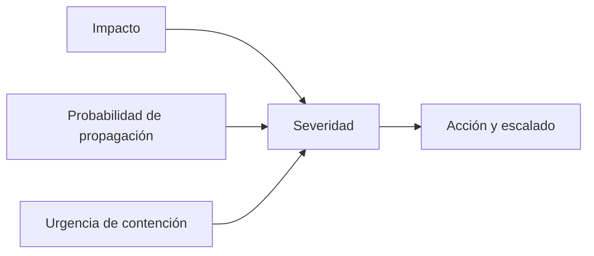

# UD2. Auditoría de incidentes de ciberseguridad

<p align="center">
  
</p>

<div align="center">


</div>

> La auditoría y la detección son la base de una respuesta efectiva: si no sabemos qué está ocurriendo, no podemos priorizar ni reaccionar con criterio. La segunda unidad se centra en la identificación, monitorización, clasificación y valoración inicial de los incidentes.

## 1. Introducción a la unidad

La auditoría de incidentes de ciberseguridad consiste en detectar, clasificar, validar, valorar y documentar los eventos de seguridad con el objetivo de decidir si constituyen un incidente y qué nivel de respuesta requieren. Esta unidad combina varios enfoques:

- taxonomía de incidentes,
- detección y monitorización,
- análisis de eventos,
- seguridad física,
- fuentes abiertas y OSINT,
- clasificación, valoración y seguimiento inicial.

El objetivo es desarrollar capacidades para transformar señales de alarma en información útil para la toma de decisiones.

## 2. Resultado de aprendizaje y criterios

### Resultado de aprendizaje 2

Analiza incidentes de ciberseguridad utilizando herramientas, mecanismos de detección y alertas de seguridad.

### Criterios de evaluación

1. Clasifica la taxonomía de incidentes de ciberseguridad.
2. Establece controles, herramientas y mecanismos de monitorización, identificación, detección y alerta.
3. Detecta incidentes de seguridad física.
4. Aplica herramientas OSINT para la identificación e investigación inicial.
5. Realiza la clasificación, valoración y seguimiento inicial de incidentes.

## 3. Conceptos clave

### 3.1. Evento, alarma e incidente

- Evento: hecho observable que puede ser relevante para la seguridad.
- Alerta: señal que indica posible anomalía.
- Incidente: evento que tiene impacto real o potencial en la seguridad de la organización.

Ejemplo:

- evento: un equipo intenta conectarse a un servicio con varias credenciales fallidas,
- alarma: el SIEM genera una alerta de fuerza bruta,
- incidente: si la autenticación fallida se repite con éxito en una cuenta administrativa y se produce un cambio de configuración relevante.

### 3.2. Taxonomía de incidentes

Los incidentes pueden clasificarse según varios criterios:

- tipo de amenaza: malware, phishing, ransomware, acceso no autorizado, denegación de servicio,
- vector de ataque: red, correo, endpoint, web, móvil,
- impacto: confidencialidad, integridad, disponibilidad,
- origen: interno, externo, proveedor, tercero,
- severidad: leve, moderado, alto, crítico.

### 3.3. Tipos comunes de incidentes

```text
- Malware y ransomware
- Phishing y suplantación
- Ingreso no autorizado
- Exfiltración de información
- Denegación de servicio
- Abuso de privilegios
- Manipulación de datos
- Seguridad física: accesos indebidos o robo de dispositivos
- Uso indebido de redes o servicios
```

## 4. Monitorización y detección

### 4.1. Qué es la monitorización

La monitorización consiste en supervisar continuamente eventos y sistemas para detectar comportamientos anómalos. Incluye sensores, registros y mecanismos de correlación.

### 4.2. Fuentes de información

- Logs del sistema operativo.
- Registros de firewall y IDS/IPS.
- Registros de antivirus y EDR.
- E-mails corporativos y proxies web.
- Servicios de autenticación y VPN.
- Telemetría de red y endpoints.

### 4.3. Herramientas de monitorización

- SIEM: correlación de eventos y alertas.
- EDR: análisis de procesos y comportamiento de endpoints.
- IDS/IPS: detección de tráfico sospechoso.
- Firewall y proxy: control de acceso y tráfico.
- NAC / control de acceso: validación de dispositivos y conexiones.
- Monitorización de activos: CPU, memoria, red, integridad.

### 4.4. Modelos de detección

- Detección basada en firmas: identifica patrones conocidos.
- Detección basada en anomalías: detecta desviaciones respecto al comportamiento habitual.
- Detección basada en comportamiento: identifica actividades sospechosas aunque no haya firma previa.

## 5. Seguridad física y controles operativos

La seguridad física es parte de la auditoría de incidentes. Un incidente digital puede tener origen o impacto en el entorno físico.

### Riesgos físicos comunes

- acceso no autorizado a salas técnicas,
- pérdida o robo de dispositivos,
- vigilancia de pantallas o documentos,
- manipulación de cables o periféricos,
- uso de USB no autorizados,
- acceso a un puesto sin supervisión.

### Controles físicos recomendados

- control de accesos por tarjeta,
- cámaras y vigilancia,
- registro de entradas,
- cierre de salas técnicas,
- identificación de personal,
- destrucción segura de equipos y soportes.

## 6. Investigación OSINT

La investigación en fuentes abiertas (OSINT) permite detectar indicios sobre amenazas, reputación, dominios, infraestructura y comportamiento asociadas a un incidente.

### Qué puede analizarse con OSINT

- dominios y subdominios,
- históricas de reputación y malware,
- menciones en redes sociales,
- actividad asociada a email o IP,
- servicios expuestos a Internet,
- contenido sospechoso relacionado con la organización.

### Ejemplo de uso OSINT

Si llega un correo de phishing intentando suplantar a la empresa:

- comprobar el dominio del remitente,
- buscar si el dominio ha sido reportado como fraudulento,
- analizar el enlace asociado,
- buscar si aparece en listados de riesgo,
- validar si ha sido usado en campañas de spam.

## 7. Valoración y clasificación inicial del incidente

### 7.1. Factores clave

La valoración inicial debe responder a preguntas como:

- ¿Qué ha ocurrido?
- ¿Qué sistema o dato se ha visto afectado?
- ¿Hay impacto en continuidad o confidencialidad?
- ¿Se ha comprometido una cuenta de alto valor?
- ¿Existe evidencia de propagación o persistencia?

### 7.2. Criterios de severidad

| Severidad | Descripción | Ejemplo |
| --- | --- | --- |
| Baja | Impacto local o limitado | Un equipo con un correo sospechoso |
| Media | Impacto en un servicio relevante | Acceso no autorizado parcial |
| Alta | Impacto operativo o de datos significativos | Exfiltración de información confidencial |
| Crítica | Impacto grave a nivel organizativo o institucional | Ransomware en servidores, apagón de servicios clave |

### 7.3. Matriz de priorización



## 8. Seguimiento inicial de incidentes

Tras la detección se debe realizar un primer seguimiento que incluya:

- validación inicial,
- identificación del alcance,
- nivel de criticidad,
- punto de contacto,
- decisiones inmediatas de contención,
- levantamiento de evidencias relevantes,
- registro del caso.

### Elementos mínimos para registrar

```text
- Fecha y hora de detección
- Sistema afectado
- Tipo de evento
- Rango de impacto
- Evidencias recabadas
- Persona responsable
- Decisiones iniciales tomadas
- Siguiente paso
```

## 9. Ejemplo práctico: detección de actividad sospechosa

### Caso

Un servidor presenta varios accesos no autorizados desde una IP extranjera a una cuenta de administrador. El SIEM genera varios eventos simples. La auditoría debe determinar si se trata de un incidente y valorar la prioridad.

### Análisis

- La IP es nueva y no pertenece a la red corporativa.
- El acceso se produce fuera del horario habitual.
- Hay intentos de elevación de privilegios tras el acceso.
- Se modifica un archivo de configuración crítico.

### Conclusión

Se clasifica como incidente de alta severidad. Requiere aislamiento inmediato, análisis forense, revisión de credenciales y comunicación a la dirección.

## 10. Ejercicios de consolidación

### Ejercicio 1. Clasificación de incidentes

Clasifica estas situaciones:

- un correo de phishing dirigido al departamento financiero,
- uso de una USB desconocida en un portátil corporativo,
- un ataque de fuerza bruta a una cuenta administrativa,
- un archivo sensible compartido por error en un canal no autorizado.

#### Solución orientativa

- Phishing: fraude y suplantación.
- USB desconocida: riesgo de malware y malware vector.
- Fuerza bruta: intento de acceso no autorizado.
- Compartición accidental: fuga de información y riesgo de confidencialidad.

### Ejercicio 2. Diseño de monitorización

¿qué fuentes monitorizarías para detectar un ransomware?

#### Solución orientativa

- comportamiento de procesos,
- cambios masivos en archivos,
- conexiones salientes sospechosas,
- accesos inusuales,
- registros de EDR,
- alarmas de firewall,
- detección de cifrado masivo.

### Ejercicio 3. Riesgos físicos y lógicos

Enumera tres riesgos de seguridad física que podrían facilitar un incidente de ciberseguridad.

#### Solución orientativa

- acceso físico a equipos sin control,
- robo de dispositivos,
- conexión de periféricos no autorizados,
- manipulación de salas técnicas o tomas de red.

### Ejercicio 4. Valoración de prioridad

Un servicio crítico deja de responder y hay evidencia de actividad anómala desde una máquina interna. ¿Qué variables debes valorar antes de decidir el nivel de respuesta?

#### Solución orientativa

- impacto crítico del servicio,
- propagación posible,
- datos afectados,
- autoría o indicios,
- tiempos de recuperación,
- necesidad de escalar a proveedores o autoridades.

## 11. Actividades prácticas recomendadas

### Actividad 1. Simulación de alerta

Usar un registro de firewall o una bitácora para identificar eventos sospechosos y clasificarlos.

### Actividad 2. Búsqueda OSINT

Analizar una URL sospechosa o un dominio relacionado con un correo de phishing.

### Actividad 3. Matriz de severidad

Crear un cuadro con incidentes hipotéticos y clasificar severidad, impacto y nivel de respuesta.

## 12. Herramientas esenciales de la unidad

- SIEM
- EDR
- IDS/IPS
- Firewall
- Wireshark
- Nmap
- OSINT framework y motores de búsqueda

## 13. Resumen

La auditoría de incidentes no consiste solo en ver alarmas, sino en interpretarlas, contextualizarlas y priorizar la respuesta. A lo largo de esta unidad se ha trabajado la base para detectar qué eventos pueden ser reales incidentes, cómo valorarlos y qué seguimiento inicial deben tener antes de pasar a la fase de investigación o contención.

## 14. Recursos recomendados

- TeoríaUD2-01-Taxonomía de los incidentes.pdf
- TeoríaUD2-02-Monitorización de eventos de seguridad.pdf
- TeoríaUD2-03-Detección del incidente y valoración.pdf

## 15. Autoevaluación

1. ¿Qué diferencia hay entre evento, alarma e incidente?
2. ¿Cómo se clasifica un incidente según impacto y severidad?
3. ¿Qué papel juega la monitorización en la detección?
4. ¿Qué elementos deben incluirse en el seguimiento inicial de un caso?
5. ¿Por qué la seguridad física también forma parte de la auditoría?

---

<p align="center">
  <strong>La auditoría de incidentes es la primera ventana de comprensión del problema: detecta, mide y orienta la respuesta.</strong>
</p>
