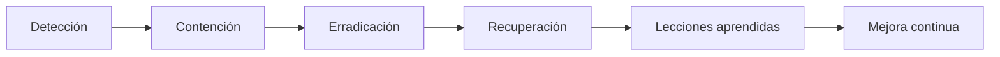

# UD4. Implementación de medidas de ciberseguridad

<p align="center">
  
</p>

<div align="center">


</div>

> Cuando se confirma un incidente, la organización debe actuar con rapidez, coordinación y criterio. Esta unidad se centra en la respuesta operativa: contención, recuperación, ciberresiliencia, escalado y prevención de que vuelva a ocurrir.

## 1. Introducción

La implementación de medidas de ciberseguridad es la fase en la que la organización convierte el conocimiento del incidente en acciones concretas. No basta con detectar y analizar: hay que responder, mitigar el daño, recuperar servicios y aprender de la experiencia.

Los contenidos clave de esta unidad son:

- procedimientos de actuación,
- medidas de respuesta y mitigación,
- capacidad de ciberresiliencia,
- toma de decisiones y escalado,
- restauración de servicios,
- lecciones aprendidas.

## 2. Resultado de aprendizaje y criterios

### Resultado de aprendizaje 4

Implementa medidas de ciberseguridad en redes y sistemas respondiendo a los incidentes detectados y aplicando las técnicas de protección adecuadas.

### Criterios de evaluación

1. Desarrolla procedimientos de respuesta y mitigación.
2. Implanta capacidades de ciberresiliencia.
3. Establece flujos de decisión y escalado adecuados.
4. Reestablece servicios afectados por incidentes.
5. Documenta lecciones aprendidas.

## 3. Fases de la respuesta



## 4. Procedimientos de respuesta

### 4.1. Contención

La contención tiene como objetivo limitar la propagación y reducir el alcance del incidente.

Ejemplos:

- aislar un equipo de la red,
- bloquear una cuenta o sesión,
- cerrar puertos,
- restringir acceso a una carpeta o servicio,
- aplicar reglas de seguridad en firewalls.

### 4.2. Erradicación

Se elimina la causa del problema:

- malware,
- accesos no autorizados,
- cambios de configuración maliciosos,
- vulnerabilidades explotadas,
- herramientas persistentes.

### 4.3. Recuperación

Se restauran servicios con seguridad:

- servicios críticos,
- equipos limpios,
- copias de seguridad verificadas,
- pruebas de integridad,
- validación de continuidad.

## 5. Ciberresiliencia

La ciberresiliencia es la capacidad de una organización para resistir, absorber y recuperarse de un incidente sin perder el servicio vital.

### Medidas de ciberresiliencia

- copias de seguridad con restauración probada,
- segmentación de red,
- sistemas redundantes,
- continuidad del negocio,
- planificación por escenarios,
- pruebas de recuperación.

## 6. Escalado y toma de decisiones

### 6.1. Quién debe decidir

La escala depende del impacto:

- técnico: equipo de seguridad o sistemas,
- operacional: dirección o responsable del servicio,
- institucional: dirección general o comité de crisis,
- externo: proveedor, autoridad, abonado o partner.

### 6.2. Criterios de escalado

- impacto en datos sensibles,
- continuidad del servicio,
- número de usuarios afectados,
- posible reputational damage,
- incidentes con terceros o terceros críticos,
- brecha legal o de cumplimiento.

## 7. Reestablecimiento de servicios

### 7.1. Requisitos previos

Antes de devolver a producción un servicio, debe verificarse:

- integridad del sistema,
- ausencia de persistencia maliciosa,
- actualización de parches,
- configuración segura,
- copias válidas,
- validación funcional.

### 7.2. Procedimiento básico

```text
1. Aislar y validar.
2. Restablecer desde una imagen limpia.
3. Comprobar integridad del sistema.
4. Aplicar parches y ajustes.
5. Rehabilitar acceso gradual.
6. Monitorizar los primeros minutos.
```

## 8. Lecciones aprendidas

La fase de cierre no debe ser solo documental; debe permitir mejorar la organización.

### Qué debe incluirse

- resumen técnico del incidente,
- causa raíz,
- medidas de respuesta,
- tiempo de detección y de contención,
- brechas detectadas,
- recomendaciones de mejora,
- plan de seguimiento.

## 9. Ejemplos prácticos

### Caso 1. Ransomware en un servidor crítico

- contención: desconectar el equipo y aislar subred,
- erradicación: limpiar desde imagen segura,
- recuperación: restauración de datos verificada,
- prevención: backups, segmentación, MFA y monitorización.

### Caso 2. Acceso no autorizado a una cuenta administrativa

- contención: bloquear acceso y cambiar credenciales,
- investigación: validar la actividad en logs,
- recuperación: revisar permisos y dispositivos,
- mejora: reforzar MFA, control de acceso y alertas.

## 10. Ejercicios de consolidación

### Ejercicio 1. Procedimiento de respuesta

Describe el procedimiento que llevarías si detectas una máquina infectada en una red corporativa.

### Ejercicio 2. Criterios de escalado

¿Qué escenarios harían que escalases un incidente a la dirección o a proveedores externos?

### Ejercicio 3. Recuperación segura

Explica qué requisitos deben cumplirse antes de devolver un sistema a producción.

### Ejercicio 4. Mejora continua

¿De qué forma una lección aprendida puede evitar futuros incidentes?

## 11. Actividades prácticas recomendadas

- diseñar un plan de respuesta ante ransomware,
- crear una matriz de escalado,
- simular una restauración de servicio,
- redactar un informe de lecciones aprendidas.

## 12. Recursos recomendados

- TeoríaUD4-04-CapacidadRespuestaIncidentes.pdf
- TeoríaUD4-05- Procedimientos de respuesta ante incidentes.pdf
- TeoríaUD4-08-Lecciones aprendidas (Revisión post-incidente y planes de acción preventivos).pdf

## 13. Resumen

La implementación de medidas convierte la detección y la investigación en una respuesta concreta, medible y sostenible. Una buena respuesta no termina cuando el servicio vuelve a funcionar; termina cuando la organización ha aprendido y reforzado su resiliencia.

## 14. Autoevaluación

1. ¿Qué diferencia hay entre contención, erradicación y recuperación?
2. ¿Cómo decidir si un incidente requiere escalado externo?
3. ¿Qué es la ciberresiliencia?
4. ¿Qué debería incluir un informe de lecciones aprendidas?
5. ¿Por qué es importante validar la restauración antes de volver a producción?

---

<p align="center">
  <strong>La ciberseguridad no solo trata de evitar el incidente, sino de recuperarse con inteligencia y aprender para no repetirlo.</strong>
</p>
